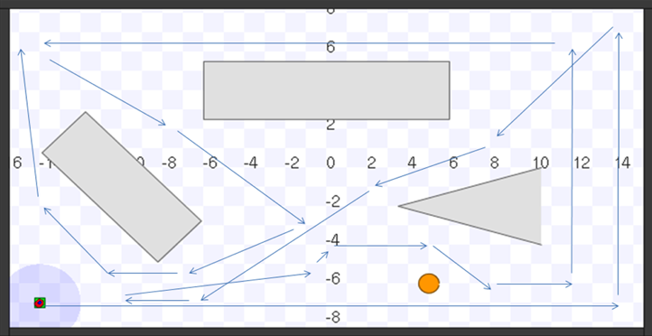

```{r knitr_setup, include = FALSE}

knitr::opts_chunk$set(
   echo = T, 
   eval = TRUE, 
   dev = 'png', 
   fig.width = 9, 
   fig.height = 4.5)

options(knitr.table.format = "latex")

```

```{r report_setup, message = FALSE, warning = FALSE, include = FALSE}

library(data.table, quietly = TRUE, warn.conflicts = FALSE)
library(dplyr, quietly = TRUE, warn.conflicts = FALSE)
library(ggthemes, quietly = TRUE, warn.conflicts = FALSE)
library(scales, quietly = TRUE, warn.conflicts = FALSE)


library(knitr, quietly = TRUE, warn.conflicts = FALSE)
library(kableExtra, quietly = TRUE, warn.conflicts = FALSE)
library(pander, quietly = TRUE, warn.conflicts = FALSE)
library(formattable, quietly = TRUE, warn.conflicts = FALSE)

library(grid, quietly = TRUE, warn.conflicts = FALSE)
library(gridExtra, quietly = TRUE, warn.conflicts = FALSE)
library(extrafont, quietly = TRUE, warn.conflicts = FALSE)
library(tinytex, quietly = TRUE, warn.conflicts = FALSE)

library(here, quietly = TRUE, warn.conflicts = FALSE)

library(lattice, quietly = TRUE, warn.conflicts = FALSE)

options(tinytex.verbose = TRUE)
suppressMessages(library("tidyverse"))

pretty_kable <- function(data, title, dig = 2) {
  kable(data, caption = title, digits = dig) %>%
    kable_styling(bootstrap_options = c("striped", "hover")) %>%
      kableExtra::kable_styling(latex_options = "hold_position")
}

theme_set(theme_light())

# Theme Overrides
theme_update(axis.text.x = element_text(size = 10),
             axis.text.y = element_text(size = 10),
             plot.title = element_text(hjust = 0.5, size = 16, face = "bold", color = "darkgreen"),
             axis.title = element_text(face = "bold", size = 12, colour = "steelblue4"),
             plot.subtitle = element_text(face = "bold", size = 8, colour = "darkred"),
             legend.title = element_text(size = 12, color = "darkred", face = "bold"),
             legend.position = "right", legend.title.align=0.5,
             panel.border = element_rect(linetype = "solid", 
                                         colour = "lightgray"), 
             plot.margin = unit(c( 0.1, 0.1, 0.1, 0.1), "inches"))

data.dir <- file.path(here::here(), "Case Studies", "datasets", "robot")

```

```{r pander_setup, include = FALSE}

knitr::opts_chunk$set(comment = NA)

panderOptions('table.alignment.default', function(df)
    ifelse(sapply(df, is.numeric), 'right', 'left'))
panderOptions('table.split.table', Inf)
panderOptions('big.mark', ",")
panderOptions('keep.trailing.zeros', TRUE)

```

# Processing Robot and Sensor Log File

## Seeking a Circular Target



### Robot Log Data

```{r}
ff <- list.files(data.dir, full.names = T)
head(ff)
```

```{r}
ff <- list.files(data.dir, full.names = T,
                 pattern = "JRSPdata.*\\.log")
head(ff)

info <- file.info(ff)
head(info)
```

```{r}
summary(info$size/1024^2)
```

```{r}
file_info <- data.frame( size = info$size/1024^2)

ggplot(file_info, aes(size)) +
   geom_density(fill = "darkgrey", alpha = .4) +
   labs(title = "Log File Size")
```

```{r}
quantile(file_info$size, seq(.9, 1, by = 0.01))
```

### Read Log File

```{r}

filename <- "D:/Projects/Statistical-Computing/Case Studies/datasets/robot/JRSPdata_2010_03_10_12_12_31.log"
lines <- readLines(filename)

readLog <- function(filename,
                    lines = readLines(filename))
{
   lines <- grep("^#", lines, invert = T, value = T)
   els <- strsplit(lines, "[[:space:]]+")
   
   # Get the interface and type so we can subset.
   iface <- sapply(els, `[`, 4)
   type <- sapply(els, `[`, 6)
   
   # find the indices corresponding to a position2d
   # with a laser immediately after.
   i <- which(iface == "position2d" & type == "001")
   i = i[ iface[i+1] == "laser" & type[i+1] == "001"]
   
   # Get the time, x, y, and then the range of values
   # from the laser below.
   locations <- t(sapply(els[i], `[`, c(1, 8, 9)))
   ranges <- t(sapply(els[i + 1], `[`, seq(14, by = 2, length = 361) ))
   
   # now combine these into a data framee
   locations <- as.data.frame(lapply(1:ncol(locations),
                                     function(i)
                                        as.numeric(locations[, i])))
   ranges <- as.data.frame(lapply(1:ncol(ranges),
                                  function(i)
                                     as.numeric(ranges[, i])))
   
   ans <- cbind(locations, ranges)
   
   names(ans) <- c("time", "x", "y",
                   sprintf("range%d", 1:ncol(ranges)))
   
   invisible(ans)
}

log <- readLog(filename, lines)

head(log)
```

### Data Exploration

```{r}
system.time(logs <- lapply(ff, readLog))
names(logs) <- ff

dur <- sapply(logs, function(x) x$time[nrow(x)] - x$time[1])

range(dur)

ggplot(data.table(dur * 30 * 60), aes(dur)) +
   geom_density(fill = "darkgrey", alpha = .4) +
   labs(title = "Robot Experiment Durations") +
   scale_x_continuous(labels = comma)
```

```{r}
range(sapply(logs, function(ll) range(ll$x)))

range(sapply(logs, function(ll) range(ll$y)))

table(sapply(logs, function(ll) all( diff(ll$time) > 0)))
```

```{r}
deltas <- unlist(lapply(logs, function(ll) diff(ll$time)))
summary(deltas)
```

```{r}
quantile(deltas, seq(.99, 1, length = 11))

which.max(deltas)

nrow(logs[["D:/Projects/Statistical-Computing/Case Studies/datasets/robot/JRSPdata_2010_03_10_12_39_46.log"]])

summary(sapply(logs, nrow))
```

```{r}
ll <- logs[["D:/Projects/Statistical-Computing/Case Studies/datasets/robot/JRSPdata_2010_03_10_12_39_46.log"]]
i <- which.max(diff(ll$time))

delta.x <- unlist(lapply(logs, function(ll) diff(ll$x)))
delta.y <- unlist(lapply(logs, function(ll) diff(ll$y)))


delta_df <- data.table(dx = delta.x, dy = delta.y)

ggplot(delta_df) +
   geom_density(aes(dx), col = "cornflowerblue") +
   geom_density(aes(dy), col = "pink") +
   labs(title = "Dx, Dy", xlab = "Distance", ylab = "Density")
```

```{r}
tail(sort(table(delta.x)))

velocity <- lapply(logs, function(ll) sqrt( diff(ll$x)^2 + diff(ll$y)^2)/diff(ll$time))

velocity_df <- data.table( velocity = unlist(velocity))

summary(velocity_df$velocity)

ggplot(velocity_df, aes(velocity)) +
   geom_density(fill = "darkgrey", alpha = .4) +
   labs(title = "Robot Velocity")
```

```{r}

plot_path <- function(ll) {
   ggplot(ll, aes(x, y)) +
      geom_point()
}

plot_path(logs[[1]])
```

```{r}
makeColorRamp <- function(n) {
   s <- (1:n)/n
   zero <- rep(0, n)
   rgb(s, (1-s), zero)
}

plot.RobotLog <-
function(x, y, col = makeColorRamp(nrow(x)), ...){
   plot(y ~ x, x, type = "p", pch = 20, col = col, ... )
   points(x$x[c(1, nrow(x))], x$y[c(1, nrow(x))],
          pch = c("O", "+"), col = c("green", "blue"))
}


par(mfrow = c(10, 10), mar = rep(0, 4), pty = 's')
invisible(lapply(logs, plot.RobotLog,
                 xlim = c(-16, 16), ylim = c(-8, 8),
                 axes = F))
```

### Exploring a "Look"

```{r}
plot.Look <-
   function(row, ...) {
      
      x <- row[1, "x"]
      y <- row[1, "y"]
      
      theta <- seq(0, 2*pi, length = 360) - pi/2
      r <- as.numeric(row[1, -c(1:3, 365)])
      x1 <- x + r * cos(theta)
      y1 <- y + r * sin(theta)
      par(pty = 's')
      plot(x + 2*cos(theta), y + 2*sin(theta),
           col = "red", type = "l",
           xlab = "x", ylab = "y", ...)
      points(x1, y1, type = "l")
   }

par(mfrow = c(1,1))
plot.Look(logs[[1]][ nrow(logs[[1]]), ])
```

```{r}
par(mfrow = c(1, 1))

index <- 2
row <- logs[[index]][ nrow(logs[[index]]), ]

x <- row[1, "x"]
y <- row[1, "y"]

theta <- seq(0, 2*pi, length = 360) - pi/2
r <- as.numeric(row[1, -c(1:3, 365)])

x1 <- x + r * cos(theta)
y1 <- y + r * sin(theta)

plot(x + 2*cos(theta), y + 2*sin(theta),
     col = "lightblue", type = "l",
     xlab = "x", ylab = "y", lwd = 2, lty=4)

eq2 <- cbind( x = x1[ which(r == 2) ], y = y1[ which(r == 2) ] )
lt2 <- cbind( x = x1[ which(r < 2) ], y = y1[ which(r < 2) ] )

points(eq2, type = "l", col="purple")
points(lt2, type ="l", col = "purple")

```

```{r}

row <- logs[[1]][ nrow(logs[[1]]), ]

plot.Look2 <- function(row, ...) {

   x <- row[1, "x"]
   y <- row[1, "y"]
   
   theta <- seq(0, 2*pi, length = 360) - pi/2
   r <- as.numeric(row[1, -c(1:3, 365)])
   
   x1 <- x + r * cos(theta)
   y1 <- y + r * sin(theta)
   
   plot(x + 2*cos(theta), y + 2*sin(theta),
        col = "lightblue", type = "l",
        xlab = "x", ylab = "y", lwd = 2, lty=4)
   
   eq2 <- cbind( x = x1[ which(r == 2) ], y = y1[ which(r == 2) ] )
   lt2 <- cbind( x = x1[ which(r < 2) ], y = y1[ which(r < 2) ] )
   
   points(eq2, type = "l", col="purple")
   points(lt2, type ="l", col = "purple")
}

par(mar = rep(0, 4), mfrow = c(10, 10), pty = 's')

invisible(lapply(logs, function(ll)
   plot.Look2(ll[ nrow(ll), ], axes = FALSE)))

```

```{r}
e <- unlist(lapply(logs, function(ll) ll$range1 - ll$range361))
summary(e)
```

```{r}
class(ll)

getRangeErrors <- function(ll) {
   ll$pos <- sprintf("%.3f,%.3f", ll$x, ll$y)
   w <- duplicated(ll$pos)
   
   if(any(w)) {
      tmp <- ll[ ll$pos %in% ll$pos[w], ]
      errs <- unlist(by(tmp[, 4:364], tmp$pos, scale, scale = F,
                        simplify = F))
      
      errs
   }
}

rangeErrs <- unlist(lapply(logs, getRangeErrors))

```


```{r}
finalLooks <- lapply(logs, function(ll) ll[nrow(ll), ])

length(finalLooks)

par(mar = rep(0, 4), mfrow = c(10, 10), pty = 's')
invisible(lapply(finalLooks, function(ll)
   plot.Look2(ll[ nrow(ll), ], axes = F)))
```

```{r}

```

