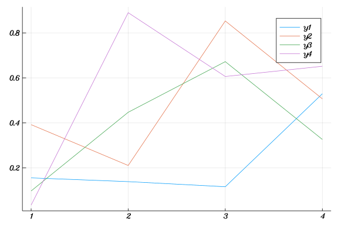

# Introduction

````julia
using Plots;
gr(fmt = :png)
````


````
Plots.GRBackend()
````


Basic Plotting

````julia
plot(rand(4, 4))
````





# Arithmetic

````julia
a = 2+2
b = a/3
c = a ÷ 3
d = 4*5

[a;b;c;d]
````


````
4-element Array{Float64,1}:
  4.0
  1.3333333333333333
  1.0
 20.0
````


````julia
α = 0.5
∇f(u) = α*u; ∇f(2)
sin(2π)
````


````
-2.4492935982947064e-16
````


# Type-stability and Code Introspection

````julia
using InteractiveUtils;

@code_llvm 2*5
````


````
;  @ int.jl:54 within `*'
; Function Attrs: uwtable
define i64 @"julia_*_14666"(i64, i64) #0 {
top:
  %2 = mul i64 %1, %0
  ret i64 %2
}
````


````julia
@code_native 2*5
````


````
.text
; ┌ @ int.jl:54 within `*'
	pushq	%rbp
	movq	%rsp, %rbp
	movq	%rcx, %rax
	imulq	%rdx, %rax
	popq	%rbp
	retq
	nopl	(%rax)
; └
````


````julia
2^5
2^-5
````


````
0.03125
````


````julia
@code_native ^(2, 5)
````


````
.text
; ┌ @ intfuncs.jl:238 within `^'
	pushq	%rbp
	movq	%rsp, %rbp
	subq	$32, %rsp
	movabsq	$power_by_squaring, %rax
	callq	*%rax
	addq	$32, %rsp
	popq	%rbp
	retq
	nopw	(%rax,%rax)
; └
````


````julia
function expo(x, y)

  if y > 0
    return x^y
  else
    x = convert(Float64, x)
    return x^y
  end
end

expo
````


````
expo (generic function with 1 method)
````


````julia
expo(2, 5)
expo(2, -5)
````


````
0.03125
````


````julia
@code_native expo(2, 5)
````


````
.text
; ┌ @ none:3 within `expo'
	pushq	%rbp
	movq	%rsp, %rbp
	pushq	%rsi
	subq	$40, %rsp
	movq	%rcx, %rsi
; │┌ @ operators.jl:294 within `>'
; ││┌ @ int.jl:49 within `<'
	testq	%r8, %r8
; │└└
	jle	L49
; │ @ none:4 within `expo'
; │┌ @ intfuncs.jl:238 within `^'
	movabsq	$power_by_squaring, %rax
	movq	%rdx, %rcx
	movq	%r8, %rdx
	callq	*%rax
; │└
	movq	%rax, (%rsi)
	movb	$2, %dl
	xorl	%eax, %eax
	addq	$40, %rsp
	popq	%rsi
	popq	%rbp
	retq
; │ @ none:6 within `expo'
; │┌ @ number.jl:7 within `convert'
; ││┌ @ float.jl:60 within `Float64'
L49:
	vcvtsi2sdq	%rdx, %xmm0, %xmm0
; │└└
; │ @ none:7 within `expo'
; │┌ @ math.jl:883 within `^'
; ││┌ @ float.jl:60 within `Float64'
	vcvtsi2sdq	%r8, %xmm1, %xmm1
	movabsq	$pow, %rax
; ││└
	callq	*%rax
; │└
	vmovsd	%xmm0, (%rsi)
	movb	$1, %dl
	xorl	%eax, %eax
; │ @ none:4 within `expo'
	addq	$40, %rsp
	popq	%rsi
	popq	%rbp
	retq
	nopw	%cs:(%rax,%rax)
; └
````


Automatic bounds checking:

````julia
function test1()
  a = zeros(3)
  for i = 1:4
    a[i] = 1
  end
end

test1()
````


````
Error: BoundsError: attempt to access 3-element Array{Float64,1} at index [
4]
````


````julia
function test2()
  a = zeros(3)
  @inbounds for i = 1:4
    a[i] = i
  end
end
test2()
````


# Type Checking

````julia
a = Vector{Any}(undef, 3)
a[1] = 1.0
a[2] = "hi!"
a[3] = :Symbolic
a
````


````
3-element Array{Any,1}:
 1.0
  "hi!"
  :Symbolic
````


````julia
a = Vector{Union{Float64, Int}}(undef, 3)
a[1] = 1.0
a[2] = 3
a[3] = 1/4
a
````


````
3-element Array{Union{Float64, Int64},1}:
 1.0
 3
 0.25
````


````julia
a = Vector{Float64}(undef, 3)
a[1] = 1.0
a[2] = 3
a[3] = 1/4
a
````


````
3-element Array{Float64,1}:
 1.0
 3.0
 0.25
````


# Drawbacks

````julia
@code_warntype 2^5
````


````
Variables
  #self#::Core.Compiler.Const(^, false)
  x::Int64
  p::Int64

Body::Int64
1 ─ %1 = Base.power_by_squaring(x, p)::Int64
└──      return %1
````


````julia
@code_warntype expo(2, 5)
````


````
Variables
  #self#::Core.Compiler.Const(Main.WeaveSandBox0.expo, false)
  x@_2::Int64
  y::Int64
  x@_4::UNION{FLOAT64, INT64}

Body::UNION{FLOAT64, INT64}
1 ─      (x@_4 = x@_2)
│   %2 = (y > 0)::Bool
└──      goto #3 if not %2
2 ─ %4 = (x@_4::Int64 ^ y)::Int64
└──      return %4
3 ─      (x@_4 = Main.WeaveSandBox0.convert(Main.WeaveSandBox0.Float64, x@_
4::Int64))
│   %7 = (x@_4::Float64 ^ y)::Float64
└──      return %7
````


````julia
using Traceur
````


````
Error: ArgumentError: Package Traceur not found in current path:
- Run `import Pkg; Pkg.add("Traceur")` to install the Traceur package.
````


````julia

@trace expo(2, 5)
````


````
Error: LoadError: UndefVarError: @trace not defined
in expression starting at none:2
````


# Dealing with Necessary Type-Instabilities

````julia
function foo(array)
  for i in eachindex(array)
    val = array[i]
    # do algorithm X on val
  end
end

function inner_foo(val)
  # do algorithm on val
end

foo(2)
````


````julia
function foo2(array::Array)
  for i in eachindex(array)
    inner_foo(array[i])
  end
end
````


````
foo2 (generic function with 1 method)
````


# Globals

In general, globals in julia have bad performance.

````julia
function test(x)
  y = x + 2
  function test2()
    y + 3
  end
  test2()
end
````


````
test (generic function with 1 method)
````


````julia
a = 3
function badidea()
  a + 2
end

a = 3.0
````


````
3.0
````


````julia
const a_cons = 3
function badidea()
  a_const + 2
end

@code_llvm badidea()
````


````
;  @ none:2 within `badidea'
; Function Attrs: uwtable
define nonnull %jl_value_t addrspace(10)* @julia_badidea_22971() #0 {
top:
  %0 = alloca %jl_value_t addrspace(10)*, i32 2
  %gcframe = alloca %jl_value_t addrspace(10)*, i32 3, align 16
  %1 = bitcast %jl_value_t addrspace(10)** %gcframe to i8*
  call void @llvm.memset.p0i8.i32(i8* align 16 %1, i8 0, i32 24, i1 false)
  %2 = call %jl_value_t*** inttoptr (i64 1720670416 to %jl_value_t*** ()*)(
) #7
  %3 = getelementptr %jl_value_t addrspace(10)*, %jl_value_t addrspace(10)*
* %gcframe, i32 0
  %4 = bitcast %jl_value_t addrspace(10)** %3 to i64*
  store i64 4, i64* %4
  %5 = getelementptr %jl_value_t**, %jl_value_t*** %2, i32 0
  %6 = getelementptr %jl_value_t addrspace(10)*, %jl_value_t addrspace(10)*
* %gcframe, i32 1
  %7 = bitcast %jl_value_t addrspace(10)** %6 to %jl_value_t***
  %8 = load %jl_value_t**, %jl_value_t*** %5
  store %jl_value_t** %8, %jl_value_t*** %7
  %9 = bitcast %jl_value_t*** %5 to %jl_value_t addrspace(10)***
  store %jl_value_t addrspace(10)** %gcframe, %jl_value_t addrspace(10)*** 
%9
  %10 = load %jl_value_t*, %jl_value_t** @delayedvar22972, align 8
  %11 = icmp eq %jl_value_t* %10, null
  br i1 %11, label %notfound, label %found

notfound:                                         ; preds = %top
  %12 = call %jl_value_t* @jl_get_binding_or_error(%jl_value_t* inttoptr (i
64 1077956272 to %jl_value_t*), %jl_value_t* inttoptr (i64 1495496432 to %j
l_value_t*))
  store %jl_value_t* %12, %jl_value_t** @delayedvar22972, align 8
  br label %found

found:                                            ; preds = %top, %notfound
  %13 = phi %jl_value_t* [ %10, %top ], [ %12, %notfound ]
  %14 = bitcast %jl_value_t* %13 to %jl_value_t addrspace(10)**
  %15 = getelementptr inbounds %jl_value_t addrspace(10)*, %jl_value_t addr
space(10)** %14, i64 1
  %16 = load %jl_value_t addrspace(10)*, %jl_value_t addrspace(10)** %15, a
lign 8
  %17 = icmp eq %jl_value_t addrspace(10)* %16, null
  br i1 %17, label %err, label %ok

err:                                              ; preds = %found
  call void @jl_undefined_var_error(%jl_value_t addrspace(12)* addrspacecas
t (%jl_value_t* inttoptr (i64 1495496432 to %jl_value_t*) to %jl_value_t ad
drspace(12)*))
  unreachable

ok:                                               ; preds = %found
  %18 = getelementptr %jl_value_t addrspace(10)*, %jl_value_t addrspace(10)
** %gcframe, i32 2
  store %jl_value_t addrspace(10)* %16, %jl_value_t addrspace(10)** %18
  %19 = getelementptr %jl_value_t addrspace(10)*, %jl_value_t addrspace(10)
** %0, i32 0
  store %jl_value_t addrspace(10)* %16, %jl_value_t addrspace(10)** %19
  %20 = getelementptr %jl_value_t addrspace(10)*, %jl_value_t addrspace(10)
** %0, i32 1
  store %jl_value_t addrspace(10)* addrspacecast (%jl_value_t* inttoptr (i6
4 398885024 to %jl_value_t*) to %jl_value_t addrspace(10)*), %jl_value_t ad
drspace(10)** %20
  %21 = call nonnull %jl_value_t addrspace(10)* @jl_apply_generic(%jl_value
_t addrspace(10)* addrspacecast (%jl_value_t* inttoptr (i64 203126768 to %j
l_value_t*) to %jl_value_t addrspace(10)*), %jl_value_t addrspace(10)** %0,
 i32 2)
  %22 = getelementptr %jl_value_t addrspace(10)*, %jl_value_t addrspace(10)
** %gcframe, i32 1
  %23 = load %jl_value_t addrspace(10)*, %jl_value_t addrspace(10)** %22
  %24 = getelementptr %jl_value_t**, %jl_value_t*** %2, i32 0
  %25 = bitcast %jl_value_t*** %24 to %jl_value_t addrspace(10)**
  store %jl_value_t addrspace(10)* %23, %jl_value_t addrspace(10)** %25
  ret %jl_value_t addrspace(10)* %21
}
````


````julia
a = 3.0
@time for i = 1:4
  global a
  a += 1
end
````


````
0.000005 seconds (4 allocations: 64 bytes)
````


````julia
function timetest()
  a = 3.0
  @time for i = 1:4
    a += 1
  end
end

timetest()
````


````
0.000000 seconds
````


````julia
timetest()
````


````
0.000000 seconds
````


