# Graphs

````julia
using CalculusWithJulia
````


$f(x) = 1 - \frac{x^2}{2}$

````julia
f(x) = 1 - x^2/2
plot(f, -3, 3)
````


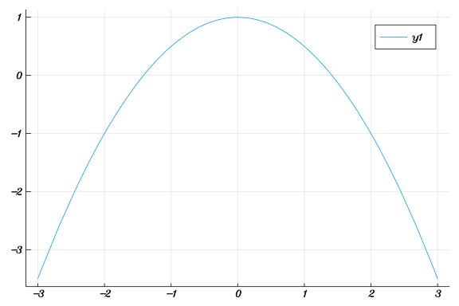

````julia
plot(sin, 0, 2pi)
````


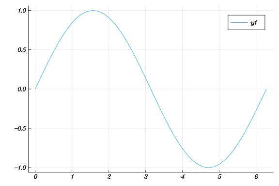


$f(x) = (1 + x^2)^{-1}$

````julia
f(x) = 1 / (1 + x^2)
plot(f, -3, 3)
````


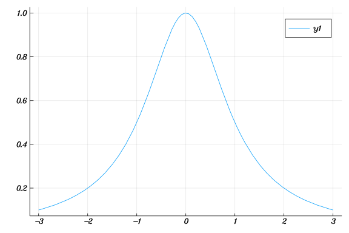


$f(x) = e^{-x^2/2}$

````julia
f(x) = exp(-x^2/2)
plot(f, -2, 2)
````


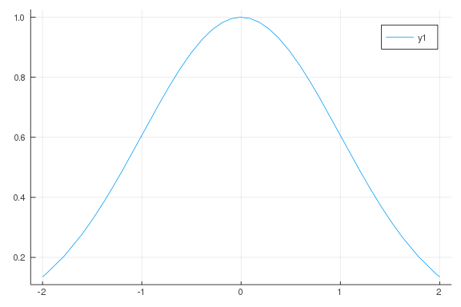

````julia
plot(x -> cos(x), 0, pi/2)
````


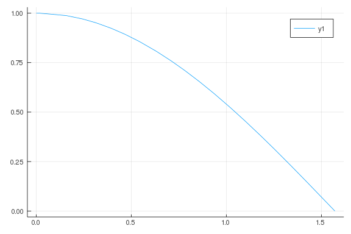

````julia
f(x) = tan(x)
plot(f, -10, 10)
````


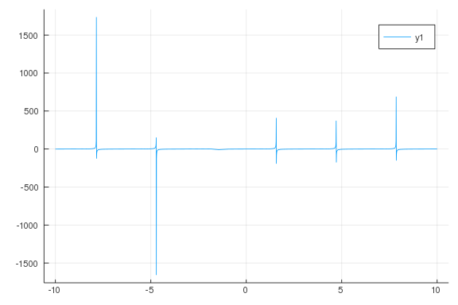

````julia
f(x) = sin(x)
xs = range(0, 2pi, length = 10)
ys = f.(xs)

plot(xs, ys)
````


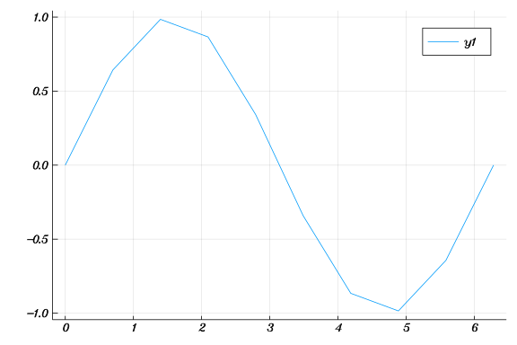

````julia
f(x) = 1/x
xs = range(-1, 1, length = 251)
ys = f.(xs)
ys[xs .== 0.0] .= NaN

plot(xs, ys)
````


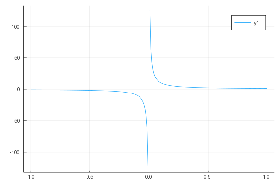

````julia
g(x) = abs(x) < .05 ? NaN : f(x)
plot(g, -1, 1)
````


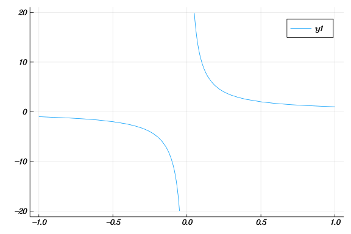

````julia
xs = range(-pi, pi, length = 100)
ys = sin.(xs)

plot(xs, ys)
````


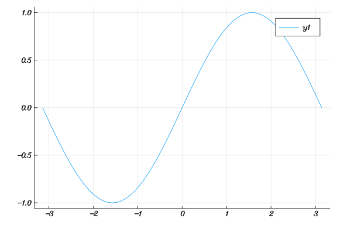

````julia
plot(-xs, ys)
````


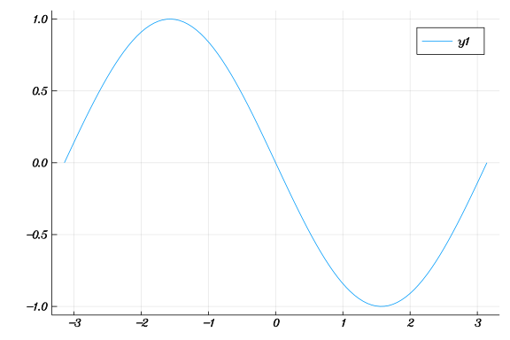

````julia
plot(ys, xs)
````


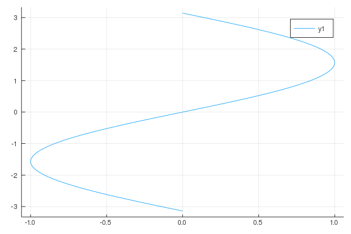

````julia
xs = range(-pi/2, pi/2, length = 100)
ys = [sin(x) for x in xs]

plot(ys, xs)
````


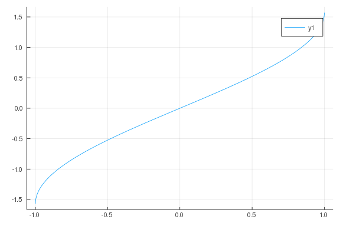

````julia
f(x) = 1 - x^2/2
plot([cos, f], -pi/2, pi/2)
````


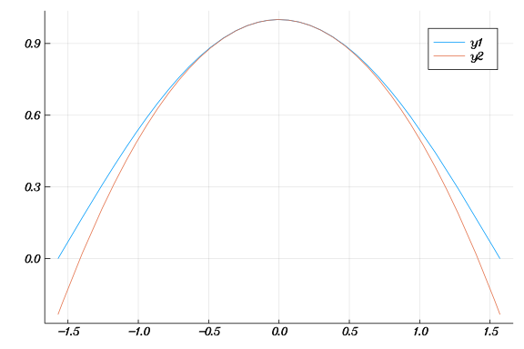

````julia
f(x) = x^5 - x + 1
plot([f, zero], -1.5, 1.4)
````


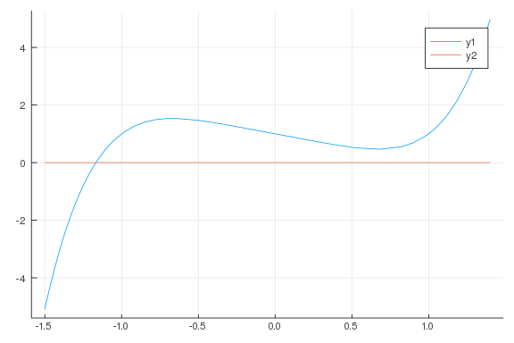

````julia
plot(f, -1.5, 1.4)
plot!(zero)
````


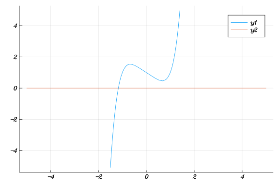

````julia
f(x) = x*(x-1)
plot(f, -1, 2)
scatter!([0, 1], [0,0])
````


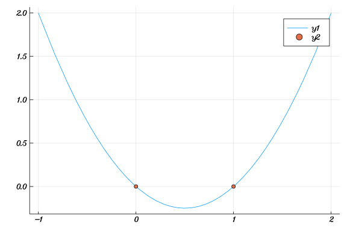

````julia
plot(f, title="plot of x*(x-1)",
    xlab = "x axis", ylab = "y axis")

plot(f, linewidth = 5)

plot(f, legend=false)

plot(f, linestyle=:dash)
plot(f, linestyle=:dot)
plot(f, linestyle=:dashdot)

scatter(f, marker = :square, legend=false)
````


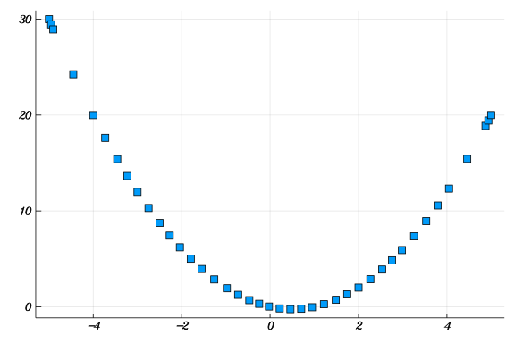


## Parametric Graphs

````julia
f(x) = cos(x); g(x) = sin(x)
xs = range(0, 2pi, length = 100)
plot(f.(xs), g.(xs))
````


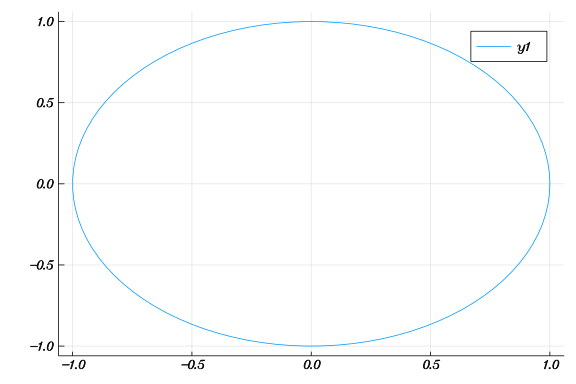

````julia
plot(f, g, 0, 2pi)
````


````julia
g(x) = x^2
f(x) = x^3
plot([g, f], 0, 25)
````


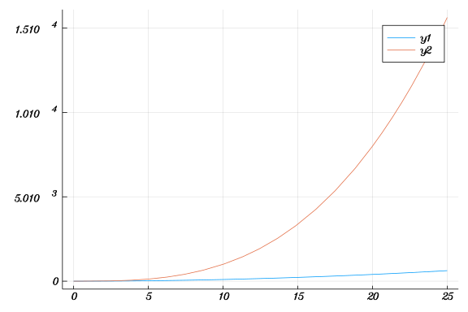

````julia
xs = range(0, 5, length = 100)
plot(g, f, 0, 25)
plot(f, g, 0, 25)
````


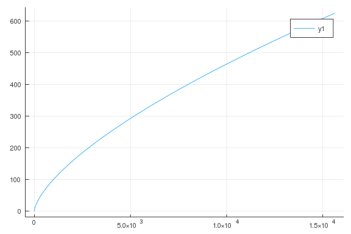

````julia
g(x) = x - sin(x)
f(x) = x^3
plot(g, f, -pi/2, pi/2)
````


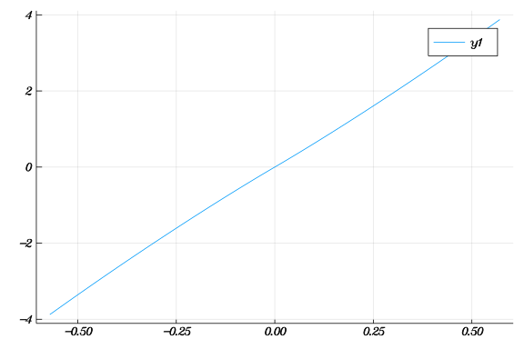

````julia
g(x) = x - sin(x)
f(x) = x^3

plot(g)
plot!(f)

plot(g, f, -pi/2, pi/2)
````


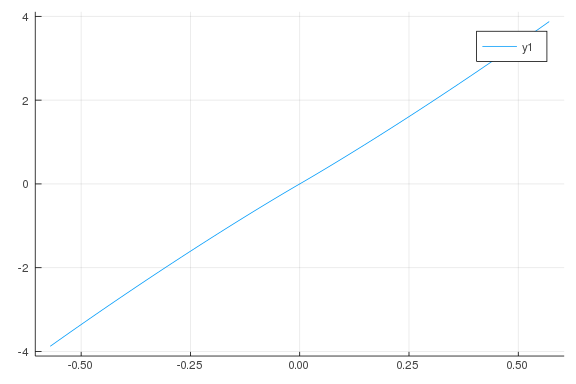

````julia
R, r, rho = 1, 1/4, 1/4

g(t) = (R-r) * cos(t) + rho * cos((R-r)/r * t)
f(t) = (R-r) * sin(t) - rho * sin((R-r)/r * t)

plot(g, f, 0, max((R-r)/r, r/(R-r))*2pi)
````


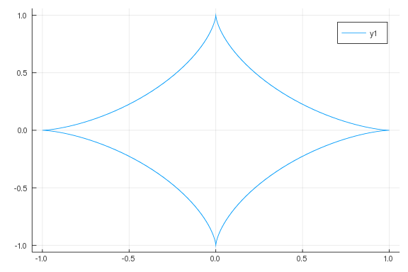

````julia
f(x) = x^3 - x
plot([f, zero], -2, 2)
````


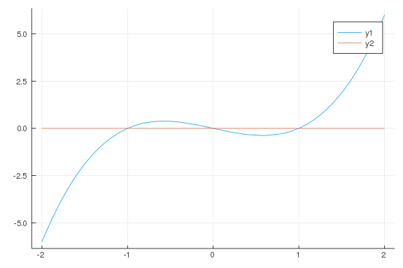

````julia
f(x) = x^3 - x

plot([f, zero])
````


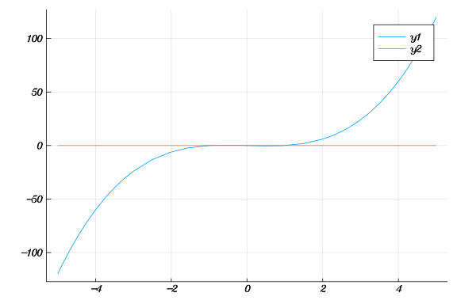


Given,

$f(x) = 3x^4 + 8x^3 - 18x^2$

Find the point at which f(x) is the smallest.

````julia
f(x) = 3x^4 + 8x^3 - 18x^2

xs = range(-4, -2, length = 100)
ys = f.(xs)

plot(f)

xs[argmin(ys)]
````


````
-2.98989898989899
````


$f(x) 3x^4 + 8x^3 - 18x^2$

When is it increasing?

````julia
f(x) = 3x^4 + 8x^3 - 18x^2

plot(f)
````


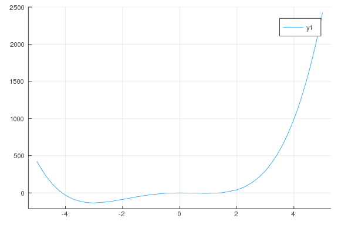


$f(x) = \frac{(x^3 - 2x)}{2x^2 - 10}$

is a rational function with issues When

$2x^2 = 10$ or $x = ±\sqrt{5}$

````julia
f(x) = (x^3 - 2x)/(2x^2 - 10)
plot([f, zero], -5, 5)
````


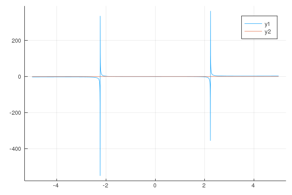

````julia
f(x) = x <= 10 ? 35.0 : 35.0 + 4.0 * (x-10)

plot(f, 0, 20)
hline!([55])
````


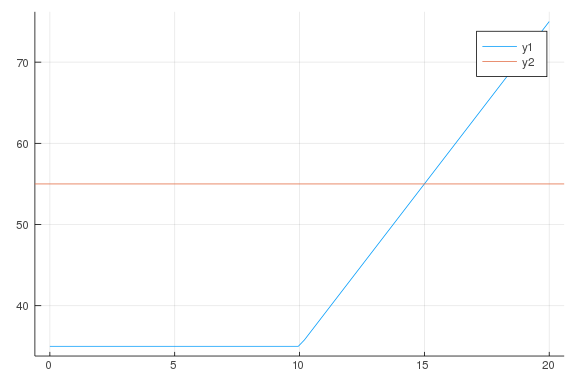

````julia
f(x) = cos(x); g(x) = x

plot([f, g])
vline!([.75])
````


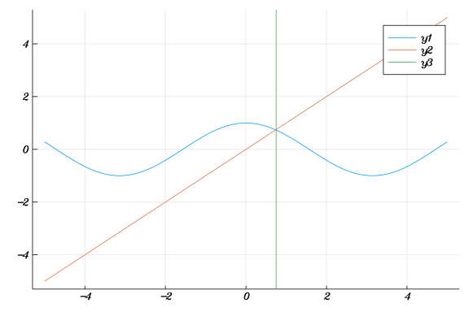

````julia
f(x) = log(x)-2
plot([f, zero],0, 10)
vline!([7.5])
````


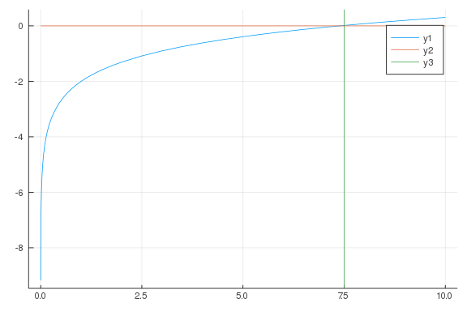

````julia
xs = range(0, 1, length=250)
f(x) = sin(500*pi*x)
plot(xs, f.(xs))

plot(f, 0, 1)
````


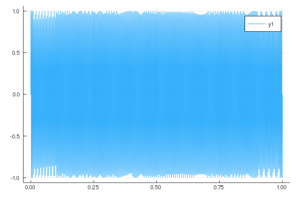

````julia
function trimplot(f, a, b, c=20; kwargs...)
   fn = x -> abs(f(x)) < c ? f(x) : NaN
   plot(fn, a, b; kwargs...)
end

f(x) = 1/x
plot(f, -1, 1)
trimplot(f, -1, 1)
````


````julia
R, r, rho = 1, 3/4, 1/4

f(t) = (R-r) * cos(t) + rho * cos((R-r)/r *t)
g(t) = (R-r) * sin(t) + rho * sin((R-r)/r *t)

plot(f, g, 0, max((R-r)/r, r/(R-r))*2pi, aspect_ratio=:equal)
````


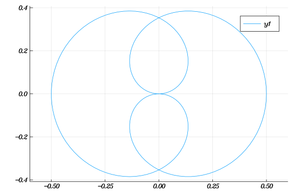

````julia
function spirograph(R, r, rho)
  f(t) = (R-r) * cos(t) + rho * cos((R-r)/r * t)
  g(t) = (R-r) * sin(t) - rho * sin((R-r)/r * t)

  plot(f, g, 0, max((R-r)/r, r/(R-r))*2pi, aspect_ratio=:equal)
end

spirograph(1, 3/4, 1/4)
````


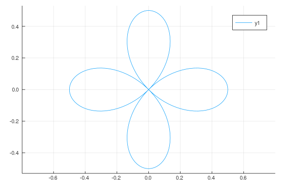

````julia
spirograph(1, 1/2, 1/4)
````


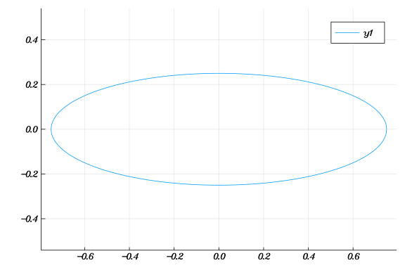

````julia
spirograph(1, 1/4, 1)
````


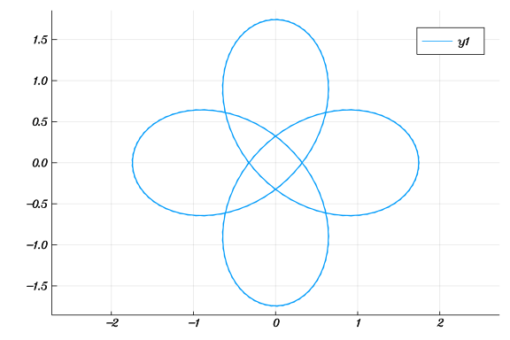

````julia
spirograph(1, 1/8, 1/4)
````


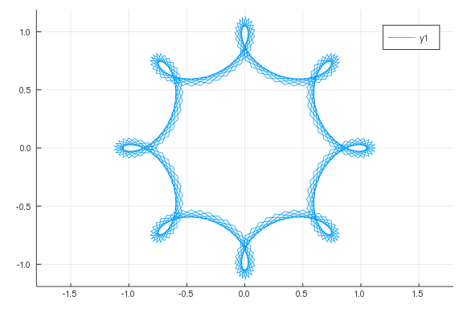
