# Transformations

$f+g(x) = f(x) + g(x)$

````julia
using Plots
using CalculusWithJulia
````


````julia
import Base:+
f::Function + g::Function = x -> f(x) + g(x)

(sin + sqrt)(4)

plot((sin + sqrt))
````


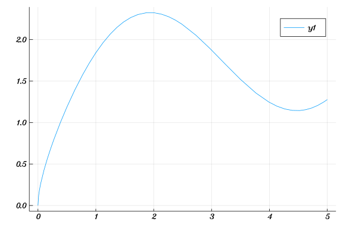

````julia
f(x) = x^2
g(x) = sin(x)
fg = f ∘ g      # typed as f \circ[tab] g
gf = g ∘ f      # typed as g \circ[tab] f
plot([fg, gf], -2, 2)
````


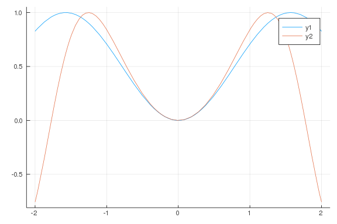

````julia
up(f, k) = x -> f(x) + k
over(f, k) = x ->f(x - k)
stretch(f, k) = x -> k * f(x)
scale(f, k) = x -> f(k * x)
````


````
scale (generic function with 1 method)
````


````julia
f(x) = 2x^2 - 8x + 12

plot(f, title = "Plot of f(x) and up(f, 3)")
plot!(up(f, 3))
````


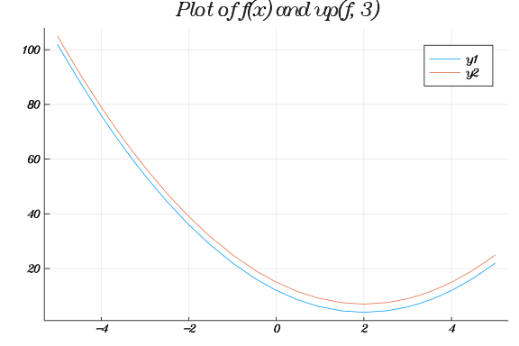

````julia
plot(f, title = "Plot of f(x) and over(f, 3)")
plot!(over(f, 3))
````


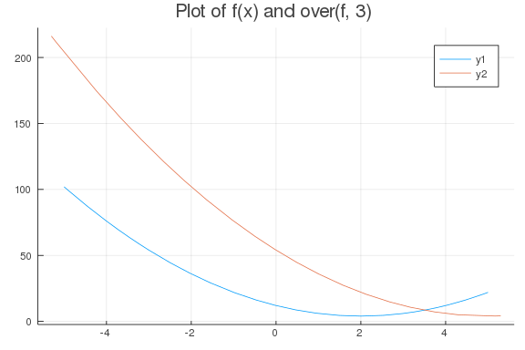

````julia
plot(f, title = "Plot of f(x) and stretch(f, 3)")
plot!(stretch(f, 3))
plot!(stretch(f, -3))
````


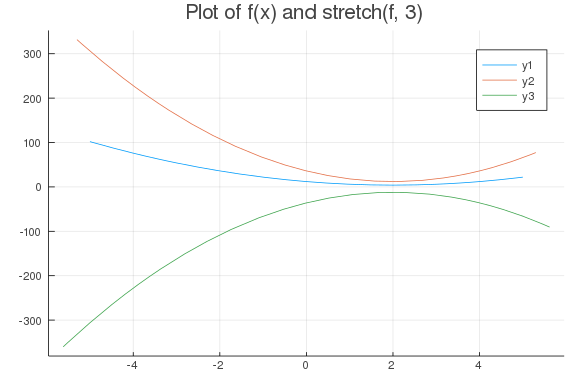

````julia
plot(f, title = "Plot of f(x) and scale(f, 3)")
plot!(scale(f, 3))
plot!(scale(f, -3))
````


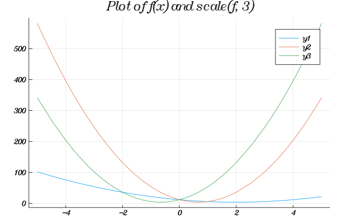

````julia
f(x) = max(0, 1 - abs(x))
plot([f, up(f, 2)], -2, 2)
plot([f, over(f, 2)], -2, 4)
plot([f, stretch(f, 2)], -2, 2)
plot([f, scale(f, 2)], -2, 2)
````


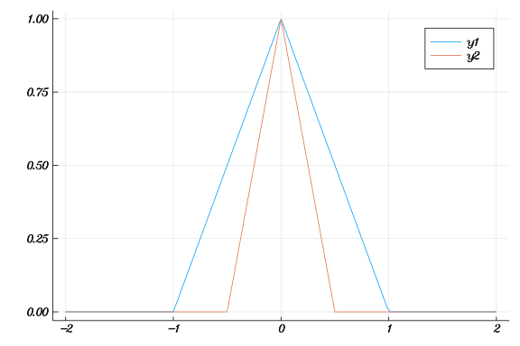

````julia
plot([f, up(over(f,2), 1)], -2, 4)
plot([f, scale(over(f,2), 1/3)], -1,9)
````


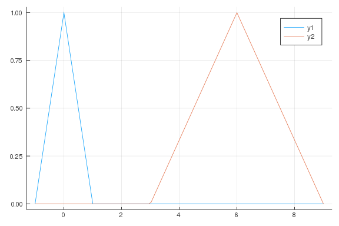

````julia
plot([f, over(scale(f, 1/3), 2)], -1, 5)
````


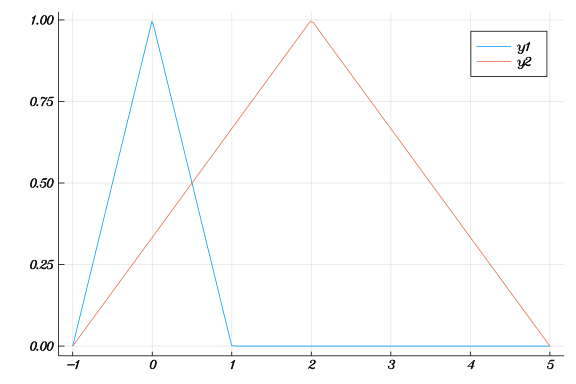


$h(x) = \frac{1}{a}f(\frac{x - b}{a})$

````julia
a = 2; b = 5
h(x) = stretch(over(scale(f, 1/a), b), 1/a)(x)
plot([f, h], -1, 8)
````


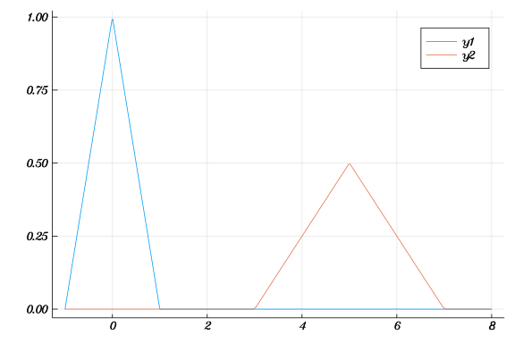


$a + bsin(d(x - c))$

````julia
a = 12
b = ((15 + 5/60 + 46/60/60) - (9 + 19/60 + 44/60/60)) / 2
d = 2pi/365

c = 79

newyork(t) = up(stretch(over(scale(sin, d), c), b), a)(t)
plot(newyork, -20, 385)
````


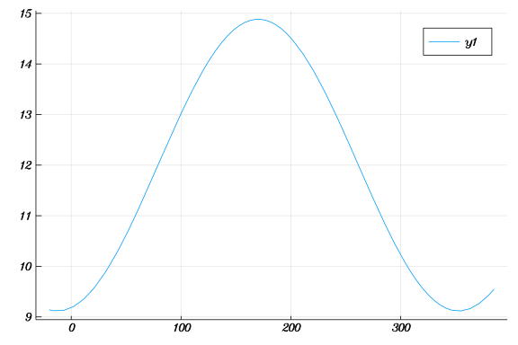


$g(x) = \sqrt(x)$
$f(x) = sin(x)$
$f(g(x)) = $

````julia
g(x) = sqrt(x)
f(x) = sin(x)

pi/2 |> g |> f
````


````
0.9500244274657834
````


von Bertanlaffy growth equation is:

$L(t) = L_{\infty} * (1 - e^{k*(t-t_0)})$

````julia
f(k) = 1 + k^2
D(f)(3), f(3) - f(3-1)
````


````
(6.0, 5)
````


````julia
S(f) = k -> sum(f(i) for i in 1:k)

S(f)(4), f(1) + f(2) + f(3) + f(4)
````


````
(34, 34)
````


````julia
k=15
S(D(f))(k),  f(k) - f(0)
````


````
(240.0, 225)
````


````julia
f(x) = 1; g(x) = x - 2

h(x) = f(x) ∘ g(x)

h
````


````
h (generic function with 1 method)
````


