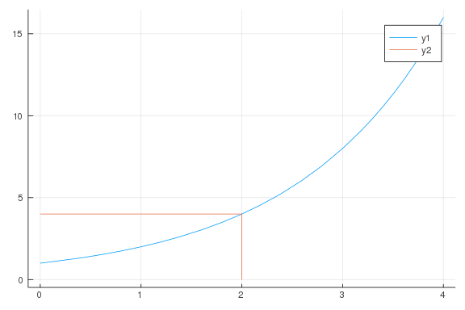
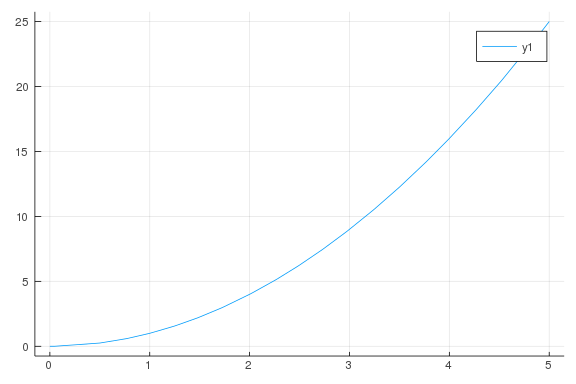
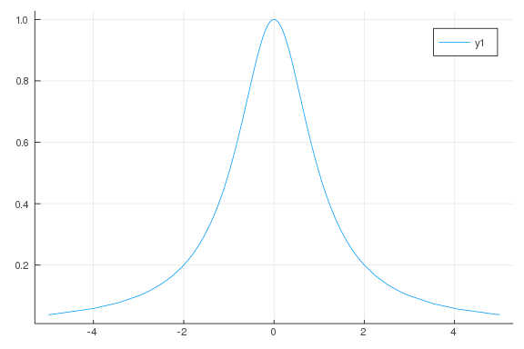
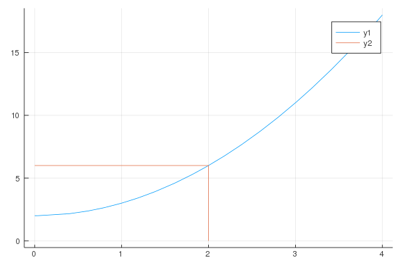
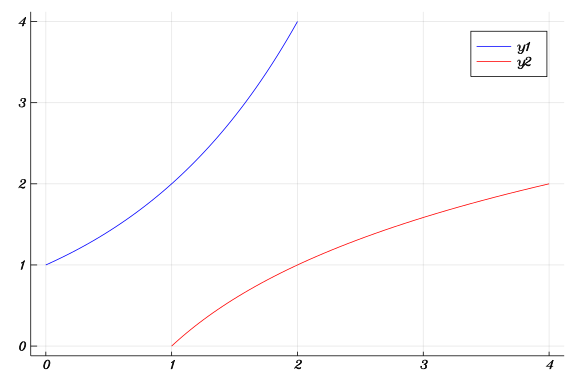
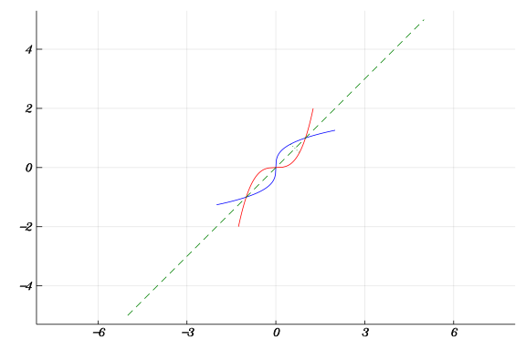
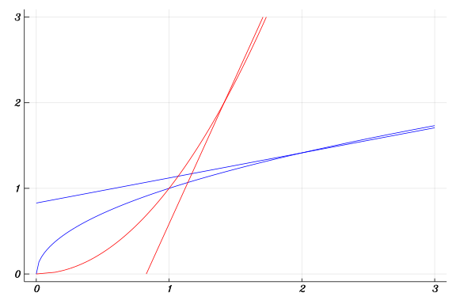
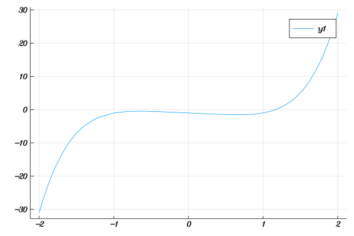
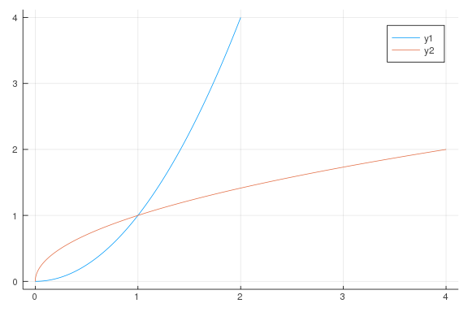

# Inverse Functions

````julia
using Plots
using CalculusWithJulia
````


````julia
f(x) = 2^x
plot(f, 0, 4)
plot!([2, 2, 0], [0, f(2), f(2)])
````




````julia
f(x) = x^2
plot(f)

plot(f, 0, 5)
````




````julia
f(x) = (1 + x^2)^-1
plot(f)
````




````julia
f(x) = x^2 + 2
plot(f, 0, 4)
plot!([2, 2, 0], [0, f(2), f(2)])
````




````julia
f(x) = 2^x
xs = range(0, 2, length = 50)
ys = f.(xs)
plot(xs, ys, color =:blue)
plot!(ys, xs, color=:red)
````




````julia
f(x) = cbrt(x)
xs = range(-2, 2, length=150)
ys = f.(xs)
plot(xs, ys, color = :blue, aspect_ratio=:equal, legend=false)
plot!(ys, xs, color = :red)
plot!(identity, color = :green, linestyle = :dash)
x, y = 1/2, f(1/2)
plot!([x, y], [y, x], color = :green, linestyle = :dot)
````





## Lines

Tangent Lines

````julia
f(x) = sqrt(x)
c = 2
tl(x) = f(c) + 1/(2 + sqrt(2)) * (x - c)
xs = range(0, 3, length = 150)
ys = f.(xs)
zs = tl.(xs)
plot(xs, ys, color = :blue, legend=false)
plot!(xs, zs, color = :blue)
plot!(ys, xs, color = :red)
plot!(zs, xs, color = :red)
````




````julia
f(x) = x^5 - x - 1
plot(f, -2, 2)
````




````julia
f(x) = x^2
xs = range(0, 2, length = 150)
ys = f.(xs)
plot(xs, ys)
plot!(ys, xs)
````




````julia
1/.7

1/13
````


````
0.07692307692307693
````


