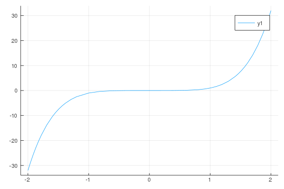

# Polynomials

````julia
using Plots
using CalculusWithJulia
````


````julia
a, b, c = symbols("a, b, c")

x = symbols("x", real = true)
````


````
x
````


````julia
p = -16x^2 + 100

typeof(p)

quad = a*x^2 + b*x + c
````


````
2          
a⋅x  + b⋅x + c
````


````julia
sin(a*(x - b*pi) + c)

quad + quad^2 - quad^3
````


````
3                   2
   2             ⎛   2          ⎞    ⎛   2          ⎞ 
a⋅x  + b⋅x + c - ⎝a⋅x  + b⋅x + c⎠  + ⎝a⋅x  + b⋅x + c⎠
````


````julia
p = -16x^2 + 100
p(p => (x-1)^2)

y = p(x => 2)

p(4)
````


````
-156
````


````julia
@vars a b c E F
p = a*x^2 + b*x + c
p(x => x-E) + F

expand(p(x => x-E) + F)
````


````
2                            2          
E ⋅a - 2⋅E⋅a⋅x - E⋅b + F + a⋅x  + b⋅x + c
````


````julia
p = -16x^2 + 100
y = p(2)
N(y)

N(PI, 60)
````


````
3.141592653589793238462643383279502884197169399375105820974939
````


````julia
plot(x^5 - x + 1, -3/2, 3/2)
````


````julia
plot(x^5, -2, 2)
````




````julia
p = a*x^2 + b*x + c
n = 2    # the degree of p
q = expand(x^n * p(x => 1/x))
````


````
2
a + b⋅x + c⋅x
````


````julia
expand((x-1)*(x-2)*(x-3))
````


````
3      2           
x  - 6⋅x  + 11⋅x - 6
````


````julia
factor(x^3 - 6x^2 + 11x -6)
````


````
(x - 3)⋅(x - 2)⋅(x - 1)
````


````julia
factor(x^5 - 5x^4 + 8x^3 - 8x^2 + 7x - 3)
````


````
2 ⎛ 2    ⎞
(x - 3)⋅(x - 1) ⋅⎝x  + 1⎠
````


````julia
factor(x^11 - x)
````


````
⎛ 4    3    2        ⎞ ⎛ 4    3    2        ⎞
x⋅(x - 1)⋅(x + 1)⋅⎝x  - x  + x  - x + 1⎠⋅⎝x  + x  + x  + x + 1⎠
````


````julia
factor(x^12 - 1)
````


````
⎛ 2    ⎞ ⎛ 2        ⎞ ⎛ 2        ⎞ ⎛ 4    2    ⎞
(x - 1)⋅(x + 1)⋅⎝x  + 1⎠⋅⎝x  - x + 1⎠⋅⎝x  + x + 1⎠⋅⎝x  - x  + 1⎠
````


@vars x j
expand(((x-j)^3 - x^3) / j)
``
