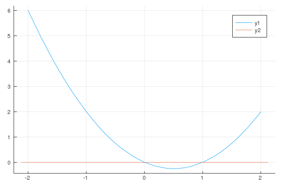
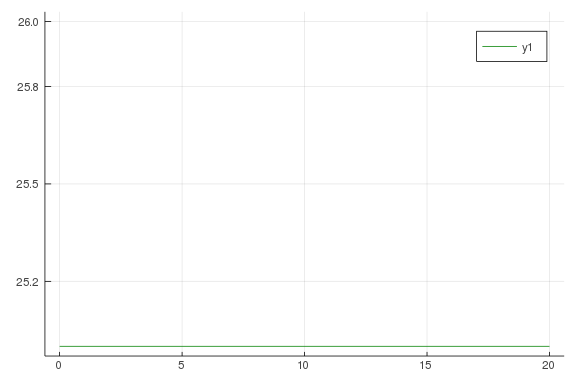
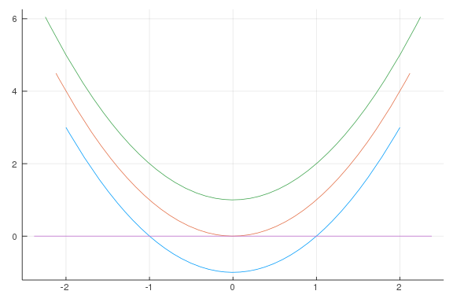
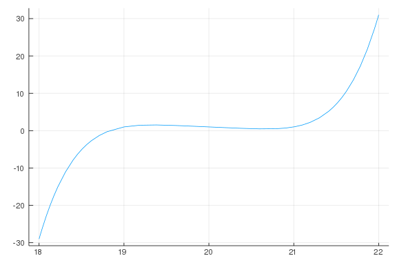
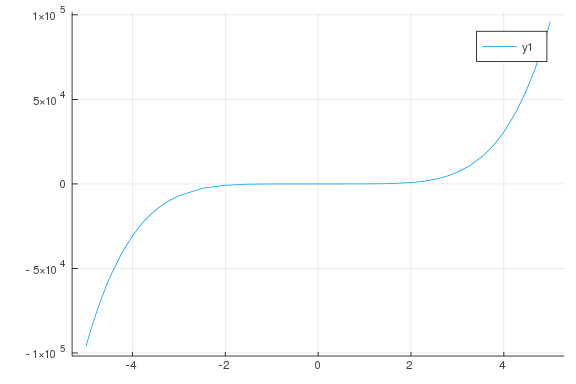

# Polynomial Roots

````julia
using CalculusWithJulia;
````


````julia
f(x) = x^2 - x
plot(f, -2, 2)
plot!(zero)
````




````julia
f(x) = log(x)
plot(f, 0, 100, legend = false)
plot!(zero)
plot!([20, 20, 0], [0, f(20), f(20)], color =:green)
plot!([40, 40, 0], [0, f(40), f(40)], color =:green)
````




````julia
f(x) = x^4 + 2x^2 + 5
g(x) = x - 2

plot(f, -5, 5, legend = false)
plot!(g)

f(2)
````


````
29
````


nieve division:

````julia
@vars x real=true

(x^4 + 2x^2 + 5) / ( x - 2)
````


````
4      2    
x  + 2⋅x  + 5
─────────────
    x - 2
````


doesn't simplify.

````julia
q, r = divrem(x^4 + 2x^2 + 5, x - 2)
````


````
(floor((x^4 + 2*x^2 + 5)/(x - 2)), x^4 + 2*x^2 - (x - 2)*floor((x^4 + 2*x^2
 + 5)/(x - 2)) + 5)
````


````julia
apart((x^4 + 2x^2 + 5) / (x-2))
````


````
3      2                29 
x  + 2⋅x  + 6⋅x + 12 + ─────
                       x - 2
````


````julia
p = 2*x^4 + x^3 - 19x^2 - 9x + 9
factor(p)
````


````
(x - 3)⋅(x + 1)⋅(x + 3)⋅(2⋅x - 1)
````


````julia
plot(x^2 - 1, -2, 2, legend = false)
plot!(x^2)
plot!(x^2 + 1)
plot!(zero)
````




````julia
solve(x^2 + 2x - 3)
````


````
2-element Array{Sym,1}:
 -3
  1
````


````julia
@vars a b c
solve(a*x^2 + b*x + c, x)
````


````
2-element Array{Sym,1}:
 (-b + sqrt(-4*a*c + b^2))/(2*a)
 -(b + sqrt(-4*a*c + b^2))/(2*a)
````


````julia
@vars a
@vars b real=true
c = symbols("c", positive=true)
solve(a^2 + 1) # works, as a can be complex

solve(b^2 + 1)

solve(c + 1) # fails, as b is assumed real
````


````
0-element Array{Any,1}
````


````julia
p = x^2 - 2
factor(p)
````


````
2    
x  - 2
````


````julia
rts = solve(p)
prod(x - r for r in rts)
````


````
(x - √2)⋅(x + √2)
````


````julia
@vars x
solve(x^4 - 2x - 1)
````


````
4-element Array{Sym,1}:
 -sqrt(-2/(3*(1/4 + sqrt(129)/36)^(1/3)) + 2*(1/4 + sqrt(129)/36)^(1/3))/2 
- sqrt(-4/sqrt(-2/(3*(1/4 + sqrt(129)/36)^(1/3)) + 2*(1/4 + sqrt(129)/36)^(
1/3)) - 2*(1/4 + sqrt(129)/36)^(1/3) + 2/(3*(1/4 + sqrt(129)/36)^(1/3)))/2
 -sqrt(-2/(3*(1/4 + sqrt(129)/36)^(1/3)) + 2*(1/4 + sqrt(129)/36)^(1/3))/2 
+ sqrt(-4/sqrt(-2/(3*(1/4 + sqrt(129)/36)^(1/3)) + 2*(1/4 + sqrt(129)/36)^(
1/3)) - 2*(1/4 + sqrt(129)/36)^(1/3) + 2/(3*(1/4 + sqrt(129)/36)^(1/3)))/2
  sqrt(-2/(3*(1/4 + sqrt(129)/36)^(1/3)) + 2*(1/4 + sqrt(129)/36)^(1/3))/2 
+ sqrt(-2*(1/4 + sqrt(129)/36)^(1/3) + 2/(3*(1/4 + sqrt(129)/36)^(1/3)) + 4
/sqrt(-2/(3*(1/4 + sqrt(129)/36)^(1/3)) + 2*(1/4 + sqrt(129)/36)^(1/3)))/2
 -sqrt(-2*(1/4 + sqrt(129)/36)^(1/3) + 2/(3*(1/4 + sqrt(129)/36)^(1/3)) + 4
/sqrt(-2/(3*(1/4 + sqrt(129)/36)^(1/3)) + 2*(1/4 + sqrt(129)/36)^(1/3)))/2 
+ sqrt(-2/(3*(1/4 + sqrt(129)/36)^(1/3)) + 2*(1/4 + sqrt(129)/36)^(1/3))/2
````


````julia
solve(x^5 - x + 1)
````


````
5-element Array{Sym,1}:
 CRootOf(x^5 - x + 1, 0)
 CRootOf(x^5 - x + 1, 1)
 CRootOf(x^5 - x + 1, 2)
 CRootOf(x^5 - x + 1, 3)
 CRootOf(x^5 - x + 1, 4)
````


````julia
rts = solve(x^5 - x + 1)
N.(rts)
````


````
5-element Array{Number,1}:
                     -1.167303978261418684256045899854842180720560371525489
039140082449275651903429536
 -0.18123244446987538 - 1.0839541013177107im
 -0.18123244446987538 + 1.0839541013177107im
   0.7648844336005847 - 0.35247154603172626im
   0.7648844336005847 + 0.35247154603172626im
````


````julia
ex = x^7 - 3x^6 + 2x^5 - 1x^3 + 2x^2 + 1x^1 - 2
solve(ex)

N.(solve(ex))
````


````
7-element Array{Number,1}:
                     1
                     2
                     1.1673039782614186842560458998548421807205603715254890
39140082449275651903429536
 -0.7648844336005847 - 0.35247154603172626im
 -0.7648844336005847 + 0.35247154603172626im
 0.18123244446987538 - 1.0839541013177107im
 0.18123244446987538 + 1.0839541013177107im
````


````julia
p = 8x^4 - 8x^2 + 1

rts = solveset(p)
````


````
⎧     ________      ________       ________      ________⎫
⎪    ╱ 1   √2      ╱ 1   √2       ╱ √2   1      ╱ √2   1 ⎪
⎨-  ╱  ─ - ── ,   ╱  ─ - ── , -  ╱  ── + ─ ,   ╱  ── + ─ ⎬
⎪ ╲╱   2   4    ╲╱   2   4     ╲╱   4    2   ╲╱   4    2 ⎪
⎩                                                        ⎭
````


````julia
elements(rts)
````


````
4-element Array{Sym,1}:
  sqrt(1/2 - sqrt(2)/4)
 -sqrt(sqrt(2)/4 + 1/2)
  sqrt(sqrt(2)/4 + 1/2)
 -sqrt(1/2 - sqrt(2)/4)
````


````julia
p =   x^5 - 100x^4 + 4000x^3 - 80000x^2 + 799999x - 3199979
plot(p, -10, 10, legend = false)

plot(p, 10, 20, legend = false)

plot(p, 18, 22, legend = false)
````




````julia
f(x) = (x - 100)^2 + 0.1
plot(f, legend = false)

@vars x
solve((x - 100)^2 + 0.1)
````


````
2-element Array{Sym,1}:
 100.0 - 0.316227766016838*I
 100.0 + 0.316227766016838*I
````


````julia
p =  x^5 - 100x^4 + 4000x^3 - 80000x^2 + 799999x - 3199979
N.(solve(p))
````


````
5-element Array{Number,1}:
                   18.83269602173858131574395410014515781927943962847451096
085991755072434809657041
 19.818767555530126 - 1.0839541013177107im
 19.818767555530126 + 1.0839541013177107im
 20.764884433600585 - 0.35247154603172626im
 20.764884433600585 + 0.35247154603172626im
````


````julia
@vars x
q, r = divrem(x^4 - x^3 - x^2 + 2, (x - 2))
q, r

N.(r)

apart(x^4 - x^3 - x^2 + 2, x - 2)
````


````
4    3    2    
x  - x  - x  + 2
````


````julia
@vars x
apart(x^4 - x^3 - x^2 + 2, x^3 - 2x)
````


````
4    3    2    
x  - x  - x  + 2
````


````julia
rem(x^4 - x^3 - x^2 + 2, (x^3 - 2x))
````


````
⎢ 4    3    2    ⎥    
 4    3    2   ⎛ 3      ⎞ ⎢x  - x  - x  + 2⎥    
x  - x  - x  - ⎝x  - 2⋅x⎠⋅⎢────────────────⎥ + 2
                          ⎢     3          ⎥    
                          ⎣    x  - 2⋅x    ⎦
````


````julia
rem(x^5 - x + 1, x^2 - x + 1)
````


````
⎢ 5        ⎥    
 5       ⎛ 2        ⎞ ⎢x  - x + 1⎥    
x  - x - ⎝x  - x + 1⎠⋅⎢──────────⎥ + 1
                      ⎢ 2        ⎥    
                      ⎣x  - x + 1⎦
````


````julia
p = x^4 - 9x^3 + 30x^2 - 44x + 24
factor(p)
````


````
3
(x - 3)⋅(x - 2)
````


````julia
@vars x real=true
factor(x^4 - 5)
````


````
4    
x  - 5
````


````julia
solve(x^4 - 5)
````


````
2-element Array{Sym,1}:
 -5^(1/4)
  5^(1/4)
````


````julia
p = x^6 - 5x^5 + x^4 - 3x^3 + x^2 - x + 1
N.(solve(p))
````


````
2-element Array{BigFloat,1}:
 0.578695809429301163385993503815351057239886717918706862529928051724777178
8177389
 4.913676990237550408977402862846526440665112258556932514057418174986895863
205524
````


````julia
p = x^5 - 3x + 1
solve(p)
````


````
3-element Array{Sym,1}:
 CRootOf(x^5 - 3*x + 1, 0)
 CRootOf(x^5 - 3*x + 1, 1)
 CRootOf(x^5 - 3*x + 1, 2)
````


````julia
using Roots

xs = fzeros(x -> x^5 - 1.5x + 1, -10, 10)
length(xs) > 1
````


````
false
````


````julia
@vars x
p = x^5 + x^4 - x^3 + x^2 + x + 1
N.(solve(p))
````


````
5-element Array{Number,1}:
                    -1.7924023578249330219392435792713132267067702306399150
5816277192721027450345562
 -0.3968066209961273 - 0.5466648645088731im
 -0.3968066209961273 + 0.5466648645088731im
  0.7930077999085938 - 0.7706020355941955im
  0.7930077999085938 + 0.7706020355941955im
````


````julia
p = x^5 + x^4 - x^3 + x^2 + x + 1
r = N.(solve(p))

length(r)
````


````
5
````


````julia
p = x^5 - 4x^4 + x^3 - 2x^2 + x
````


````
5      4    3      2    
x  - 4⋅x  + x  - 2⋅x  + x
````


````julia
p = x^5 - 4x^4 + x^3 - 2x^2 + x
solve(p)
````


````
5-element Array{Sym,1}:
                                                                           
                                                                           
                                                                           
                                                            0
  1 + sqrt(-11/(18*(199/216 + sqrt(1137)/36)^(1/3)) + 2*(199/216 + sqrt(113
7)/36)^(1/3) + 10/3)/2 + sqrt(-2*(199/216 + sqrt(1137)/36)^(1/3) + 11/(18*(
199/216 + sqrt(1137)/36)^(1/3)) + 20/3 + 16/sqrt(-11/(18*(199/216 + sqrt(11
37)/36)^(1/3)) + 2*(199/216 + sqrt(1137)/36)^(1/3) + 10/3))/2
 -sqrt(-11/(18*(199/216 + sqrt(1137)/36)^(1/3)) + 2*(199/216 + sqrt(1137)/3
6)^(1/3) + 10/3)/2 + 1 - sqrt(-16/sqrt(-11/(18*(199/216 + sqrt(1137)/36)^(1
/3)) + 2*(199/216 + sqrt(1137)/36)^(1/3) + 10/3) - 2*(199/216 + sqrt(1137)/
36)^(1/3) + 11/(18*(199/216 + sqrt(1137)/36)^(1/3)) + 20/3)/2
 -sqrt(-11/(18*(199/216 + sqrt(1137)/36)^(1/3)) + 2*(199/216 + sqrt(1137)/3
6)^(1/3) + 10/3)/2 + 1 + sqrt(-16/sqrt(-11/(18*(199/216 + sqrt(1137)/36)^(1
/3)) + 2*(199/216 + sqrt(1137)/36)^(1/3) + 10/3) - 2*(199/216 + sqrt(1137)/
36)^(1/3) + 11/(18*(199/216 + sqrt(1137)/36)^(1/3)) + 20/3)/2
 -sqrt(-2*(199/216 + sqrt(1137)/36)^(1/3) + 11/(18*(199/216 + sqrt(1137)/36
)^(1/3)) + 20/3 + 16/sqrt(-11/(18*(199/216 + sqrt(1137)/36)^(1/3)) + 2*(199
/216 + sqrt(1137)/36)^(1/3) + 10/3))/2 + 1 + sqrt(-11/(18*(199/216 + sqrt(1
137)/36)^(1/3)) + 2*(199/216 + sqrt(1137)/36)^(1/3) + 10/3)/2
````


````julia
p = 32x^5 - 32x^3 + 6x
solve(p)

plot(p)
````



