# Rational Functions

````julia
using CalculusWithJulia   # to load the `Plots` and `SymPy` packages

f(x) = (x-1)^2 * (x-2) / ((x+3)*(x-3) )
plot(f, -10, 10)
````


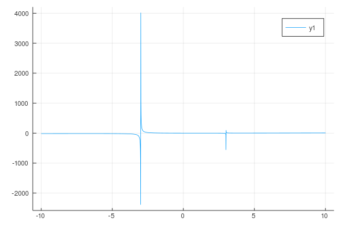

````julia
plot(f, -100, 100)
````


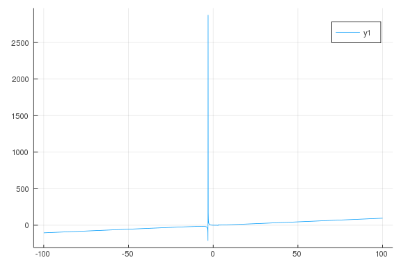

````julia
@vars x real=true
a = (x-1)^2 * (x-2)
b = (x+3)*(x-3)
````


````
(x - 3)⋅(x + 3)
````


````julia
q, r = divrem(a, b)
````


````
(floor((x - 2)*(x - 1)^2/((x - 3)*(x + 3))), -(x - 3)*(x + 3)*floor((x - 2)
*(x - 1)^2/((x - 3)*(x + 3))) + (x - 2)*(x - 1)^2)
````


````julia
q + r/b
````


````
⎢               2⎥                  
 
                                       ⎢(x - 2)⋅(x - 1) ⎥                  
2
⎢               2⎥   - (x - 3)⋅(x + 3)⋅⎢────────────────⎥ + (x - 2)⋅(x - 1)
 
⎢(x - 2)⋅(x - 1) ⎥                     ⎣(x - 3)⋅(x + 3) ⎦                  
 
⎢────────────────⎥ + ──────────────────────────────────────────────────────
─
⎣(x - 3)⋅(x + 3) ⎦                       (x - 3)⋅(x + 3)
````


````julia
f(x) = (x-1)^2 * (x-2) / ((x+3)*(x-3))  # as a function
p = f(x)                                # a symbolic expression
apart(p)
````


````
40          2    
x - 4 + ───────── + ─────────
        3⋅(x + 3)   3⋅(x - 3)
````


````julia
plot(apart(p) - (x - 4), 10, 100)
````


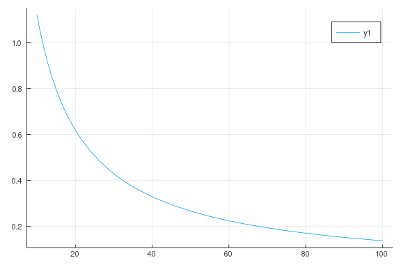

````julia
cancel(p)
````


````
3      2          
x  - 4⋅x  + 5⋅x - 2
───────────────────
        2          
       x  - 9
````


````julia
p = (x^5 - 2x^4 + 3x^3 - 4x^2 + 5) / (5x^4 + 4x^3 + 3x^2 + 2x + 1)
apart(p)
````


````
3       2                     
x      116⋅x  - 68⋅x  + 23⋅x + 139      14
─ + ───────────────────────────────── - ──
5      ⎛   4      3      2          ⎞   25
    25⋅⎝5⋅x  + 4⋅x  + 3⋅x  + 2⋅x + 1⎠
````


````julia
a = 5x^3 + 6x^2 + 2
b = x - 1
q, r = divrem(a, b)
````


````
(floor((5*x^3 + 6*x^2 + 2)/(x - 1)), 5*x^3 + 6*x^2 - (x - 1)*floor((5*x^3 +
 6*x^2 + 2)/(x - 1)) + 2)
````


````julia
plot(a/b, -3, 3)
plot!(q)
````


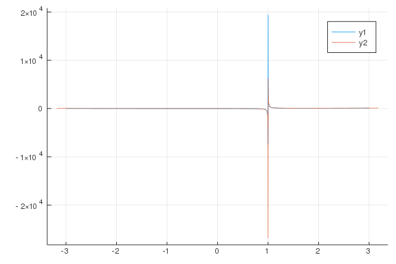

````julia
plot(a/b, 5, 10)
plot!(q)
````


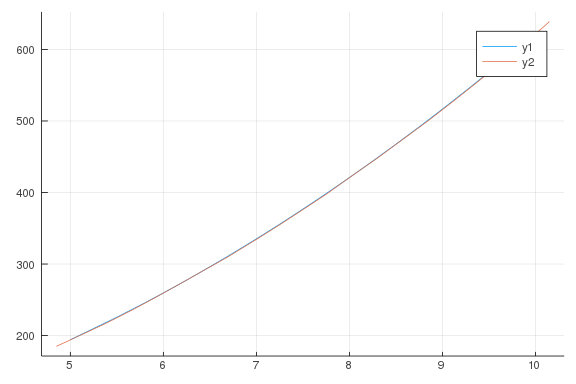

````julia
x = symbols("x")
p = (x-1)*(x-2)
q = (x-3)^3 * (x^2-x-1)
apart(p/q)
````


````
2⋅x - 1           2            1            2     
─────────────── - ────────── + ────────── + ──────────
   ⎛ 2        ⎞   25⋅(x - 3)            2            3
25⋅⎝x  - x - 1⎠                5⋅(x - 3)    5⋅(x - 3)
````


````julia
plot(1/x, -1, 1)
````


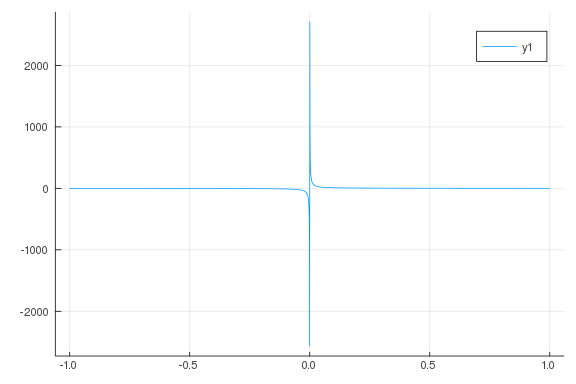

````julia
f(x) = (x-1)^2 * (x-2) / ((x+3)*(x-3))
f(3), f(-3)
````


````
(Inf, -Inf)
````


````julia
f(x) = (x-1)^2 * (x-2) / ((x+3)*(x-3) )
plot(f, -2.9, 2.9)
````


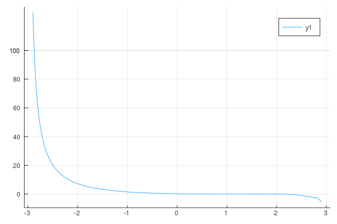

````julia
plot(f, -5, 5, ylims=(-20, 20))
````


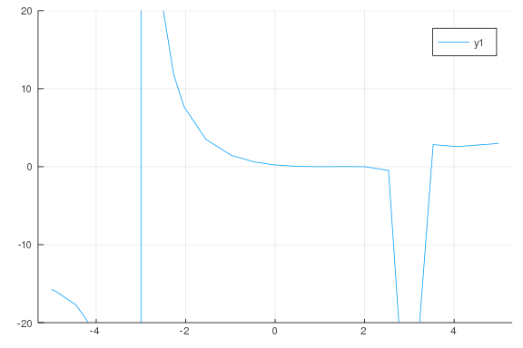

````julia
function trim_plot(f, a, b, c=20; kwargs...)
   fn = x -> abs(f(x)) < c ? f(x) : NaN
   plot(fn, a, b; kwargs...)
end
````


````
trim_plot (generic function with 2 methods)
````


````julia
trimplot(f, -25, 25, 30)
````


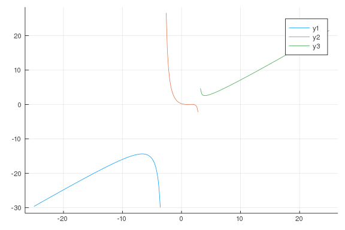

````julia
function sign_chart(f, a, b)
   xs = range(a, stop=b, length=200)
   ys = f.(xs)
   cols = [fx < 0 ? :red  : :blue for fx in ys]
   plot(xs, ys, color=cols, linewidth=5, legend=false)
   plot!(zero)
   end
````


````
sign_chart (generic function with 1 method)
````


````julia
f(x) = x^3 - x
signchart(f, -3/2, 3/2)
````


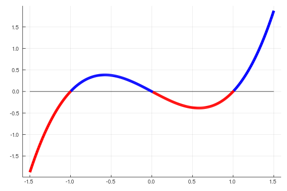

````julia
sin_p(x) = (x - (7/60)*x^3) / (1 + (1/20)*x^2)
tan_p(x) = (x - (1/15)*x^3) / (1 - (2/5)*x^2)
plot(sin, -pi, pi)
plot!(sin_p)
````


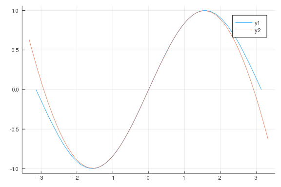

````julia
plot(tan, -pi/2 + 0.2, pi/2 - 0.2)
plot!(tan_p)
````


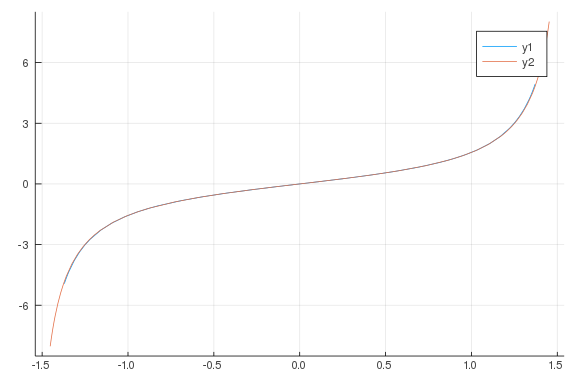

````julia
t = symbols("t")
fr(t) = 50t^2 / (t^3 + 20)

fr(1)
plot(fr, 0, 60)
````


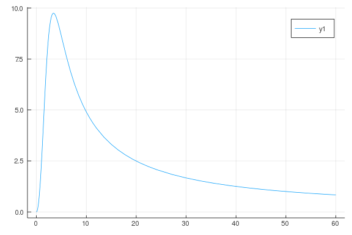

````julia
fr(24)
````


````
2.0803236058942502
````


````julia
plot(fr, 0, 60)
vline!([3.5])
````


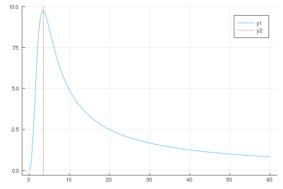
