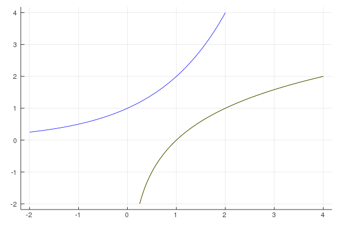
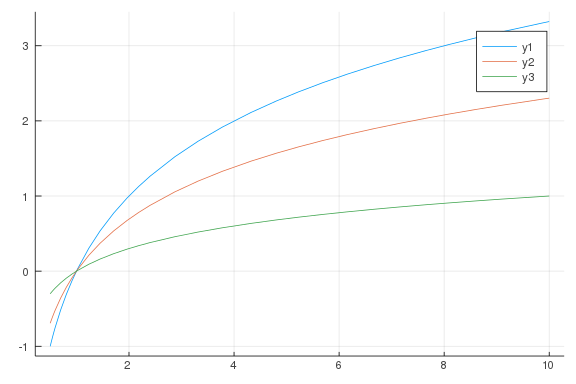
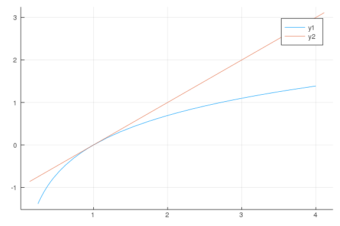
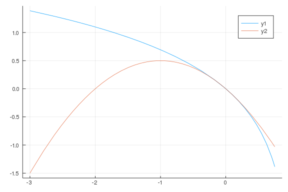

# Exponential and Logarithmic Functions

````julia
using CalculusWithJulia
````


# Exponentials

````julia
f1(x) = (1/2)^x
f2(x) = 1^x
f3(x) = 2^x
f4(x) = exp(x)

plot([f1, f2, f3, f4], -2, 2, legend = false)
````


````julia
r2, r8 = 0.02, 0.08
P0 = 1000
t = 20
P0 * exp(r2*t), P0 * exp(r8*t)
````


````
(1491.8246976412704, 4953.0324243951145)
````


````julia
t2, t8 = 72/2, 72/8
exp(r2*t2), exp(r8*t8)
````


````
(2.0544332106438876, 2.0544332106438876)
````


````julia
n = 2 * 24
2^(n/6)
````


````
256.0
````


# Logarithms

````julia
f(x) = 2^x
xs = range(-2, stop=2, length=100)
ys = f.(xs)
plot(xs, ys, color=:blue, legend=false)
plot!(ys, xs, color=:red)
xs = range(1/4, stop=4, length=100)
plot!(xs, log2.(xs), color=:green)
````




````julia
log2(1_000_000)
````


````
19.931568569324174
````


````julia
-5730 * log2(1/10)
````


````
19034.647983704584
````


````julia
plot(log2, 1/2, 10) # base 2
plot!(log, 1/2, 10) # base e
plot!(log10, 1/2, 10) # base 10
````




````julia
2^( ((7*4) / 4) + 1)
````


````
256.0
````


````julia
3 * (5/6)^5
````


````
1.205632716049383
````


````julia
log(100) - log(1/100)
````


````
9.210340371976184
````


````julia
10*log(130) / 10*log(126)
````


````
23.540768794201337
````


````julia
plot(log, 1/4, 4)
f(x) = x - 1
plot!(f)
````




````julia
f(x) = log(1-x)
g(x) = -x - x^2/2
plot([f,g], -3, 3/4)
````



