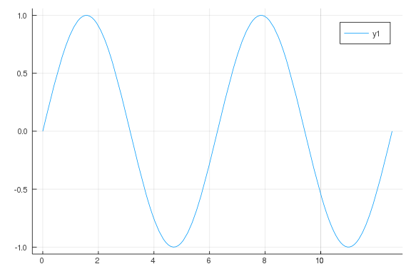
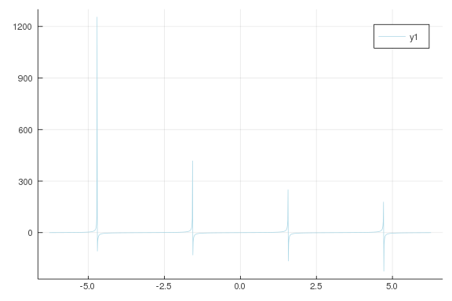
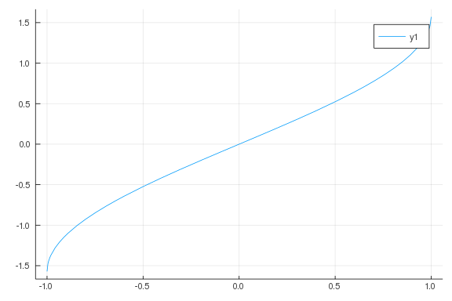
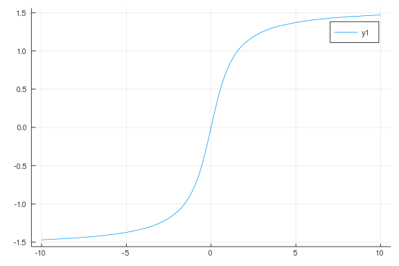
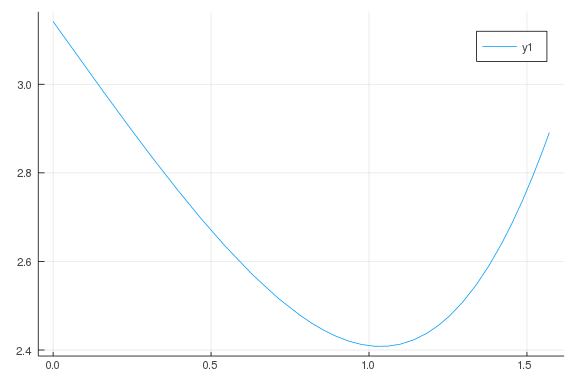
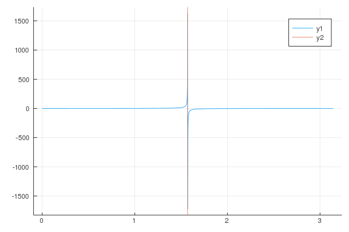
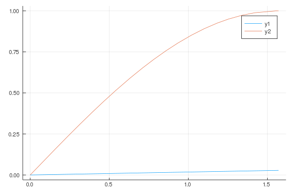

# Trigonometric Functions

````julia
using CalculusWithJulia
````


````julia
[cos(theta) for theta in [0, pi/6, pi/4, pi/3, pi/2]]
````


````
5-element Array{Float64,1}:
 1.0
 0.8660254037844387
 0.7071067811865476
 0.5000000000000001
 6.123233995736766e-17
````


````julia
cos.([0, PI/6, PI/4, PI/3, PI/2])
````


````
5-element Array{Sym,1}:
         1
 sqrt(3)/2
 sqrt(2)/2
       1/2
         0
````


````julia
theta = 15 * 180/pi
adjacent = 100
opposite = adjacent * tan(theta)
````


````
-466.6470644343919
````


````julia
tan(10*pi/180)

30*3/6
````


````
15.0
````


````julia
1/30, tan(2*pi/180)
````


````
(0.03333333333333333, 0.03492076949174773)
````


````julia
plot(sin, 0, 4pi)
````




````julia
plot([sin, cos], 0, 4pi)
````


````julia
xs = range(-2pi, 2pi, step = 0.01)
ys = tan.(xs)

for index in length(xs)
  y = abs(ys[index])
  if y < 0.01 || y > 10
    ys[index] = NaN
  end
end

plot(xs, ys, color=:lightblue)
````




````julia
plot(asin, -1, 1)
````




````julia
plot(atan, -10, 10)
````




````julia
theta = 3pi/4                     # 2.35619...
x,y = (cos(theta), sin(theta))    # -0.7071..., 0.7071...
atan(y/x)
````


````
-0.7853981633974484
````


````julia
atan(y, x)
````


````
2.356194490192345
````


δ = θ - α + arcsin(n sin(α - arcsin(1/n sin(θ))))

````julia
n, alpha, theta0 = 1.5, pi/3, pi/6
delta = theta0 - alpha + asin(n * sin(alpha - asin(sin(theta0)/n)))
````


````
0.8219769749498015
````


````julia
n, alpha, theta0 = 1.5, pi/15, pi/10
delta = theta0 - alpha + asin(n * sin(alpha - asin(sin(theta0)/n)))
delta, (n-1)*alpha
````


````
(0.10763338241545499, 0.10471975511965977)
````


````julia
n = 4/3
D(i) = pi + 2i - 4 * asin(sin(i)/n)
plot(D, 0, pi/2)
````




````julia
rad2deg(1.0)
````


````
57.29577951308232
````


````julia
T4(x) = (8x^4 - 8x^2 + 1) / 8
q1(x) = (x+3/5)*(x+1/5)*(x-1/5)*(x-3/5)
plot([x -> abs(T4(x)), x -> abs(q1(x))], -1,1)
````


````julia
sin(1.23456)
cos(6.54321)
````


````
0.966383629795993
````


````julia
x = pi/4

cos(x)
x
````


````
0.7853981633974483
````


````julia
cos(x)
pi/2 * sin(x)
sin(x - pi/2)
sin(x + pi/2)
````


````
0.7071067811865476
````


````julia
plot(sec, 0, pi)
vline!([pi/2])
````




````julia
xs = range(0, 180)
sindeg(x) = 4x*(180 - x)/(40500 - x*(180 -x))

xs = range(0, 180, step = .1)
y1 = sindeg.(xs)
y2 = sin.(xs)

delta = y1 - y2
sort(delta)

plot([sindeg, sin], 0, pi/2)
````




````julia
f(x) = cos(x/3)
````


````
f (generic function with 1 method)
````


````julia
n=10
f(x) = cos(x) - n*x

plot(f, 0, pi/2)
vline!([pi/31])

function searchsortednearest(a,x)
   idx = searchsortedfirst(a,x)
   if (idx==1); return idx; end
   if (idx>length(a)); return length(a); end
   if (a[idx]==x); return idx; end
   if (abs(a[idx]-x) < abs(a[idx-1]-x))
      return idx
   else
      return idx-1
   end
end

xs = range(pi/32, pi/31, step = .000001)
ys = f.(xs)

xs[searchsorted(ys, 0)]

xs[10]
vals = (xs, ys)
````


````
(0.09817477042468103:1.0e-6:0.10134077042468104, [0.01343702242538658, 0.01
3426924407748508, 0.013416826389115455, 0.013406728369487197, 0.01339663034
8863736, 0.01338653232724496, 0.013376434304631202, 0.01336633628102235, 0.
013356238256418074, 0.013346140230818704  …  -0.018447376496931955, -0.0184
57477655874355, -0.018467578815811514, -0.018477679976743433, -0.0184877811
38670334, -0.018497882301592217, -0.01850798346550886, -0.01851808463042048
4, -0.018528185796326646, -0.0185382869632279])
````


