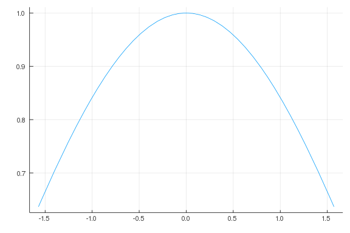
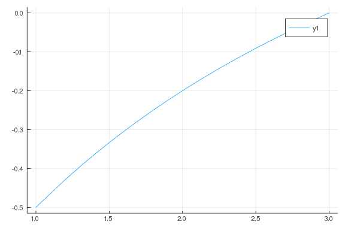
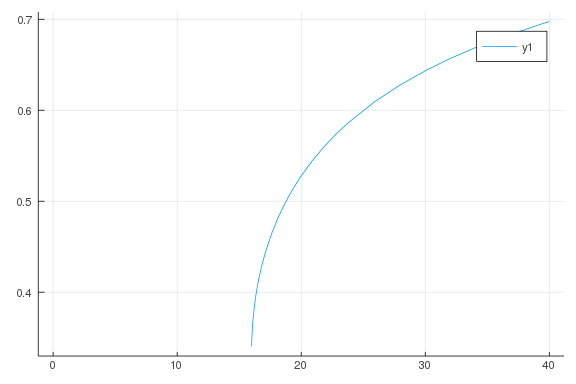
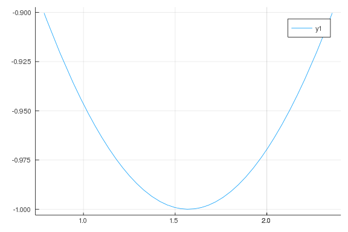
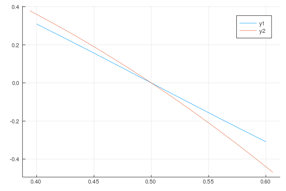
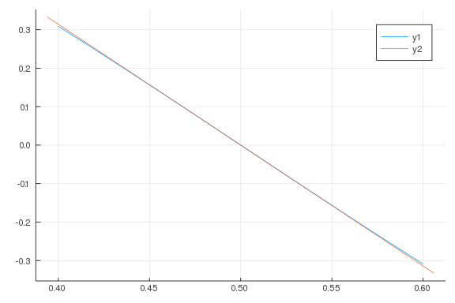
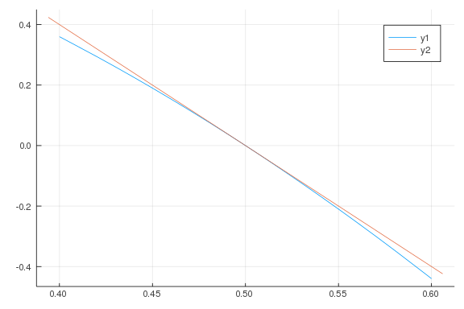
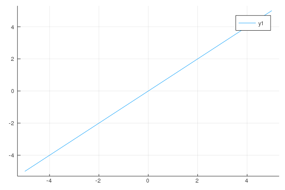
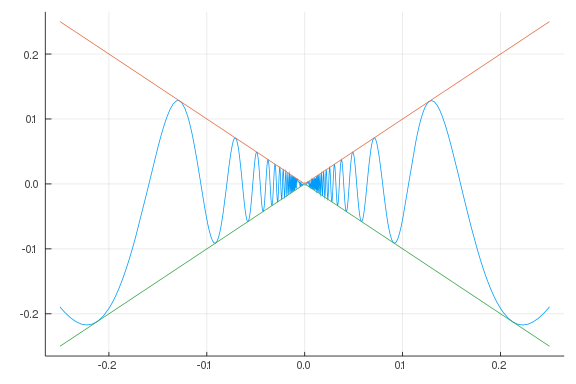
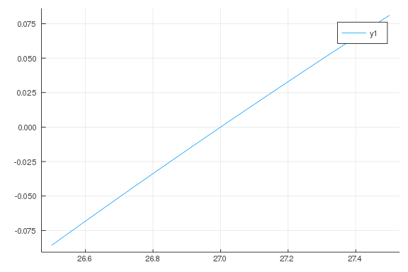

# Limits

````julia
using CalculusWithJulia  # to load Plots and SymPy
````


````julia
x = 1/10000
(1 + x)^(1/x)
````


````
2.7181459268249255
````


````julia
f(x) = (1 + x)^(1/x)
xs = [1/10^i for i in 1:10]
[xs f.(xs)]
````


````
10×2 Array{Float64,2}:
 0.1      2.59374
 0.01     2.70481
 0.001    2.71692
 0.0001   2.71815
 1.0e-5   2.71827
 1.0e-6   2.71828
 1.0e-7   2.71828
 1.0e-8   2.71828
 1.0e-9   2.71828
 1.0e-10  2.71828
````


````julia
x = 1
sin(x) / x
````


````
0.8414709848078965
````


````julia
f(x) = sin(x)/x
plot(f, -pi/2, pi/2, legend=false)
````




````julia
plot([sin, x -> x], -pi/2, pi/2)
````


$\lim_{x→2}\frac{x^2 - 5x + 6}{x^2 + x - 6}$

````julia
f(x) = (x^2 - 5x + 6) / (x^2 + x - 6)
c = 2
f(c)
````


````
NaN
````


````julia
c, delta = 2, 1
plot(f, c - delta, c + delta)
````




````julia
f(x) = x == 2.0 ? -0.2 : (x^2 - 5x + 6) / (x^2 + x - 6)
````


````
f (generic function with 1 method)
````


$\lim_{x→25}\frac{\sqrt{x} - 5}{\sqrt{x - 16} - 3}$

````julia
f(x) = (sqrt(x) - 5)/(sqrt(x - 16) - 3)
c = 25
f(c)

plot(f, 0, 40)
````




````julia
hs = [1/10^i for i in 1:8]

xs = c .+ hs
ys = f.(xs)
````


````
8-element Array{Float64,1}:
 0.6010616008415922
 0.6001066157341047
 0.6000106661569936
 0.6000010666430725
 0.6000001065281493
 0.6000000122568625
 0.5999999946709295
 0.6
````


````julia
[xs ys]
````


````
8×2 Array{Float64,2}:
 25.1     0.601062
 25.01    0.600107
 25.001   0.600011
 25.0001  0.600001
 25.0     0.6
 25.0     0.6
 25.0     0.6
 25.0     0.6
````


````julia
xs = c .- hs
ys = f.(xs)
[xs ys]
````


````
8×2 Array{Float64,2}:
 24.9     0.598928
 24.99    0.599893
 24.999   0.599989
 24.9999  0.599999
 25.0     0.6
 25.0     0.6
 25.0     0.6
 25.0     0.6
````


````julia
c = 1
f(x) = x^x
ys = [(f(c + h) - f(c))/h for h in hs]
[hs ys]
````


````
8×2 Array{Float64,2}:
 0.1     1.10534
 0.01    1.01005
 0.001   1.001
 0.0001  1.0001
 1.0e-5  1.00001
 1.0e-6  1.0
 1.0e-7  1.0
 1.0e-8  1.0
````


````julia
ys = [(f(c + h) - f(c))/h for h in -hs]
[-hs ys]
````


````
8×2 Array{Float64,2}:
 -0.1     0.904674
 -0.01    0.99005
 -0.001   0.999
 -0.0001  0.9999
 -1.0e-5  0.99999
 -1.0e-6  0.999999
 -1.0e-7  1.0
 -1.0e-8  1.0
````


$\lim_{x→0}\frac{1 - cos(x)}{x^2}$

````julia
f(x) = (1 - cos(x))/x^2
f(0)

c = 0
xs = c .+ hs
ys = [f(x) for x in xs]
[xs ys]
````


````
8×2 Array{Float64,2}:
 0.1     0.499583
 0.01    0.499996
 0.001   0.5
 0.0001  0.5
 1.0e-5  0.5
 1.0e-6  0.500044
 1.0e-7  0.4996
 1.0e-8  0.0
````


````julia
y1s = [1 - cos(x) for x in xs]
y2s = [x^2 for x in xs]
[xs y1s y2s]
````


````
8×3 Array{Float64,2}:
 0.1     0.00499583   0.01
 0.01    4.99996e-5   0.0001
 0.001   5.0e-7       1.0e-6
 0.0001  5.0e-9       1.0e-8
 1.0e-5  5.0e-11      1.0e-10
 1.0e-6  5.00044e-13  1.0e-12
 1.0e-7  4.996e-15    1.0e-14
 1.0e-8  0.0          1.0e-16
````


````julia
@vars x real=true
f(x) = (1 - cos(x))/x^2
limit(f(x), x => 0)
````


````
1/2
````


````julia
limit(f, 0)
````


````
1/2
````


````julia
limit( (2sin(x) - sin(2x)) / (x - sin(x)), x => 0)
````


````
6
````


````julia
f(x) = (exp(x) - 1 - x)/x^2

plot(f)

limit(f, 0)
````


````
1/2
````


````julia
@vars rho real=true
limit( (x^(1-rho) - 1) / (1 - rho), rho => 1)
````


````
log(x)
````


````julia
c = pi/2
f(x) = cos(x) / (x - pi/2)
f(c)
````


````
Inf
````


````julia
limit(f(x), x => PI/2)
````


````
0
````


````julia
plot(f, c - pi/4, c + pi/4)
````




````julia
f(x) = cos(x) / (x - PI/2)
limit(f(x), x => PI/2)
````


````
-1
````


````julia
g(x) = cos(PI*x) / (1 - (2x)^2)
limit(g, 1/2)
````


````
0.25⋅π
````


````julia
limit(sin(PI*x)/(PI*x) * g(x), x => 1/2)
````


````
0.500000000000000
````


````julia
plot(cos(pi*x), 0.4, 0.6)
plot!(1 - (2x)^2)
````




````julia
plot(cos(pi*x), 0.4, 0.6)
plot!(-pi*(x - 1/2))
````




````julia
plot(1 - (2x)^2, 0.4, 0.6)
plot!(-4(x - 1/2))
````




````julia
f(x) = 3x + 2
c, L = 1, 5
epsilon = rand()
delta = epsilon / 3
xs = c .+ delta * rand(100)
as = [abs(f(x) - L) < epsilon for x in xs]
all(as)
````


````
true
````


````julia
f(x) = (cos(x) - 1) / x

plot(x)
````




````julia
sin(0)
cos(0)
````


````
1.0
````


````julia
f(x) = x == 0 ? NaN : x * sin(1/x)
c, delta = 0, 1/4
plot([f, abs, x -> -abs(x)], c - delta, c + delta, legend=false)
````




````julia
f(x) = (3x^2 - x - 10)/(x^2 - 4)

plot(f, 1.9, 2.1)

factor((3x^2 - x - 10)/(x^2 - 4))

limit((3x^2 - x - 10)/(x^2 - 4), x => 2)

11/4
````


````
2.75
````


````julia
-1/48
limit((1/x + 1/2)/(x^3 + 8), x => -2)
````


````
-1/48
````


````julia
f(x) = (x - 27)/(x^1/3 - 3)
limit(f(x), x => 27)

plot(f, 26.5, 27.5)
````




````julia
f(x) = tan(2x) / (x - PI/2)

limit(f(x), x => PI/2)
````


````
2
````


````julia
limit(sind(x)/x, x => 0)
````


````
π
````


````julia
limit(sin(x), x => 0)
limit(cos(x), x => 0)
````


````
1
````


