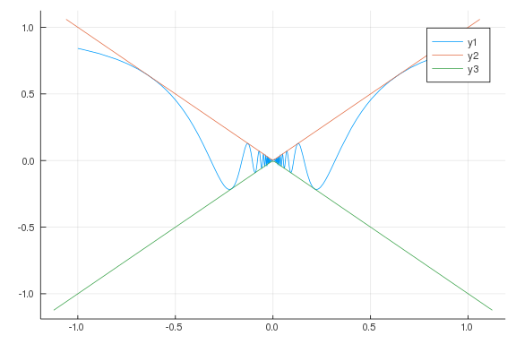

# Limit Extensions


$f(x) = sin(1/x)$

````julia
using CalculusWithJulia;
````


````julia
f(x) = x* sin(1/x)
plot(f, -1, 1)
plot!(abs)
plot!(x -> -abs(x))
````




````julia
f(x) = abs(x)/x
plot(f, -2, 2)
````


