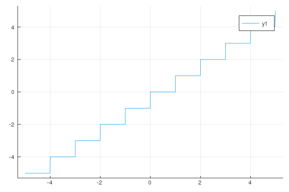
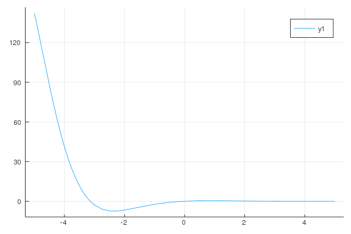
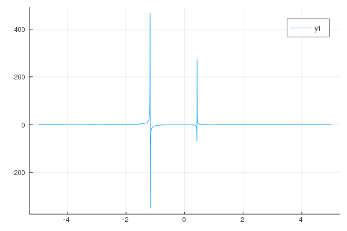
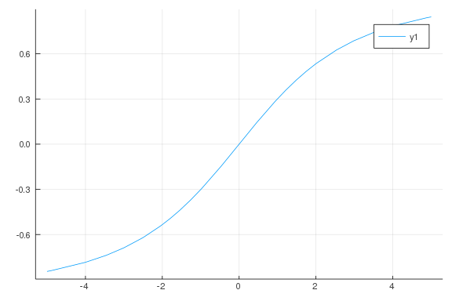
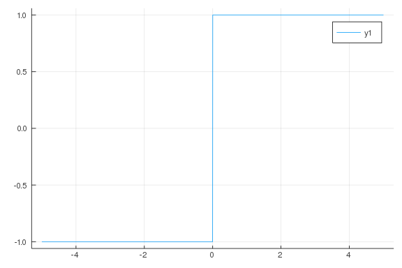
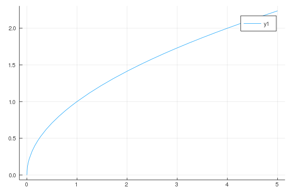

# Limit Extensions


$f(x) = sin(1/x)$

````julia
using CalculusWithJulia
````


````julia
f(x) = x* sin(1/x)
plot(f, -1, 1)
plot!(abs)
plot!(x -> -abs(x))
````


````julia
f(x) = abs(x)/x
plot(f, -2, 2)
````


````julia
f(x) = abs(x)/x
plot(f, -2, 2)
````


````julia
@vars x
f(x) = abs(x)/x
limit(f(x), x => 0, dir="+"), limit(f(x), x => 0, dir="-")
limit(f(x), x => 0)
````


````
1
````


````julia
plot(floor, -5, 5)
````




````julia
@vars x real=true
limit(x^x, x, 0, dir="+")
````


````
1
````


````julia
limit(sin(x), x=> oo)
````


````
<-1, 1>
````


````julia
@vars x real=true
f(x) = exp(-x)*sin(x)
limit(f(x), x => oo)

plot(f)
````




````julia
f(x) = (x^2 - 2x + 2)/(4x^2 + 3x - 2)
limit(f(x), x => oo)
plot(f)
````




````julia
f(x) = x / sqrt(x^2 + 4)
plot(f)
limit(f(x), x => oo), limit(f(x), x => oo)
````


````
(1, 1)
````


````julia
f(x) = x/sqrt(x^2 + 10)
plot(f)
````




````julia
f(x) = abs(x)/x
plot(f)
````




````julia
f(x) = 1/x
limit(f(x), x=>0, dir="-"), limit(f(x), x=>0, dir="+")
````


````
(-oo, oo)
````


````julia
f(x) = x^x * (1 + log(x))
plot(f, 1/100, 1)

limit(f(x), x=>0, dir="+")
````


````
-∞
````


````julia
# rationals make for an exact answer
@vars i n integer=true
s(n) = 1//2 * summation((1//4)^i, (i, 0, n))
````


````
s (generic function with 1 method)
````


````julia
f(x) = sqrt(x)
plot(f)
````




````julia
f(x) = sin(x)/x
plot(f)

limit(f(x), x => Inf, dir="+")
````


````
0
````


````julia
f(x) = (1 - cos(x))/x^2
plot(f, -50, 50)

limit(f(x), x => Inf)
````


````
0
````


````julia
f(x) = log(x)/x
plot(f, 0, 50)

limit(f(x), x => Inf)
````


````
0
````


````julia
f(x) = (x-3)/(x-2)
plot(f, .1, 5)

f(1.99)

limit(f(x), x => 2, dir="+")
````


````
-∞
````


````julia
f(x) = (x-3)/(x+3)
plot(f, .1, 5)

f(2.99)

limit(f(x), x => 3, dir="-")
````


````
0
````


````julia
f(x) = sin(1/x)
plot(f, .0001, 1)

f(2.99)

limit(f(x), x => 3, dir="-")
````


````
sin(1/3)
````


````julia
k = 1

f(x) = x^(k*x)
plot(f, 0, 1)

limit(f(x), x => 0, dir="+")
````


````
1
````


````julia
k = 2

f(x) = x^(1/log(k, x))

plot(f, 0, 1)
limit(f(x), x => 0, dir="+")
````


````
2
````


````julia
a = 0

f(x) = sin(1/x)

s₁ =
plot(f, 0, 1)

limit(f(x), x => 0, dir="+")
````


````
<-1, 1>
````


