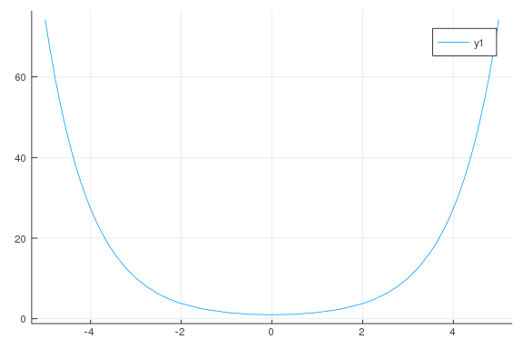
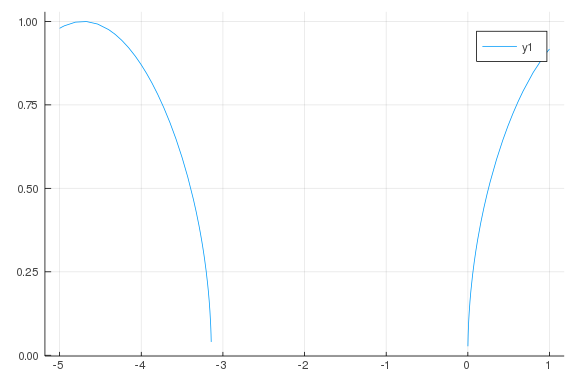

# Continuity

````julia
using CalculusWithJulia
````


````julia
f(x) = (e^x + e^(-x))/2
plot(f)
````




````julia
@vars x c
ex1 = 3x^2 + c
ex2 = 2x-3
del = limit(ex1, x=>0, dir="+") - limit(ex2, x=>0, dir="-")
````


````
c + 3
````


````julia
solve(del, c)
````


````
1-element Array{Sym,1}:
 -3
````


````julia
f(x) = sqrt(sin(x))
plot(f)
````




````julia
@vars x
ex3 = (x^2 - 4)/(x - 2)
plot(ex3)

limit(ex3, x => 2)
````


````
4
````


````julia
ex4 = x^2*(cos(1/x) - 1)
plot(ex4)

limit(ex4, x => 0)
````


````
0
````


````julia
c = 0

f(x) = if x < 0 3x - 4 else -3 + sin(2x - pi/2) end
plot(f)

ex6 = sin(2x - pi/2)
limit(ex6, x => 0, dir="+")

ex7 = 3x - 4
limit(ex7, x => 0)
````


````
-4
````


