# Implications of continuity

````julia
using CalculusWithJulia
````


````julia
function bisection(f, a, b)

  f(a) == 0 && return(a)
  f(b) == 0 && return(b)

  f(a) * f(b) > 0 && error("[a, b] is not in a bracketing interval.")

  tol = 1e-14 # small epsilon
  c = a/2 + b/2

  while abs(b-a) > tol

    f(c) == 0 && return(c)

    if f(a) * f(c) < 0
      a, b = a, c
    else
      a, b = c, b
    end

    c = a/2 + b/2

  end

  c
end
````


````
bisection (generic function with 1 method)
````


````julia
c = bisection(sin, 3, 4)

plot(sin, legend=false)
vline!([0, c])
hline!([0])

sin(c)
````


````
1.2246467991473532e-16
````


### Package Approach

````julia
find_zero(sin, (3, 4))
````


````
3.1415926535897936
````


The polynomial $f(x) = x^5 - x + 1$

has a zero between −2 and −1. Find it.

````julia
f(x) = x^5 - x + 1

plot(f, legend=false)
hline!([0])

c = bisection(f, -2, -1)

vline!([c])

show((c, f(c)))
````


````
(-1.167303978261419, -2.220446049250313e-15)
````


````julia
f(x) = exp(x) - x^4
plot(f, 5, 10, legend = false)
hline!([0])

c = bisection(f, 8, 9)

vline!([c])
````


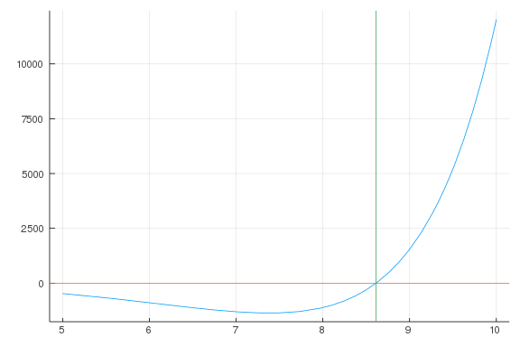


Find ALL zeros.

````julia
f(x) = x^3 - x + 1
plot(f, -3, 3)
hline!([0])

c = bisection(f, -3, 3)

vline!([c])
````


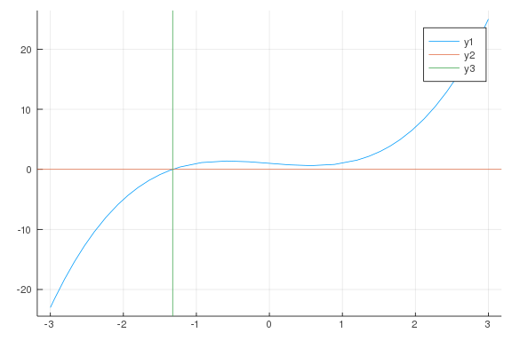

````julia
f(x) = cos(x)
g(x) = x
plot(f, -pi, pi, legend = false)
plot!(g)
hline!([0])

h(x) = f(x) - g(x)
c = bisection(h, 0, 2)

vline!([c])
````


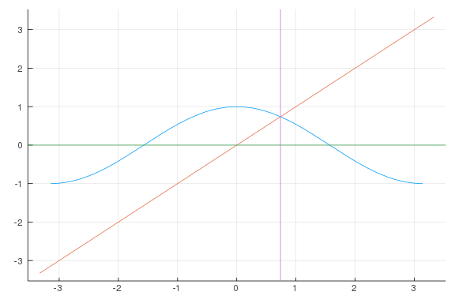

````julia
plan1(x) = 47.49 + 0.77x
plan2(x) = 30.00 + 2.00x

plot(plan1, 10, 20)
plot!(plan2)

c = find_zero(x -> plan1(x) - plan2(x), (10, 20))

vline!([c])
````


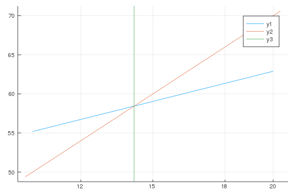


### Flight of an Arrow

````julia
j(x; theta=pi/4, g=32, v0=200) = tan(theta)*x - (1/2)*g*(x/(v0*cos(theta)))^2

function y(x; theta=pi/4, g=32, v0=200, gamma=1)
	 a = gamma * v0 * cos(theta)
	 (g/a + tan(theta)) * x + g/gamma^2 * log((a-gamma^2 * x)/a)
end

plot(j, 0, 500)


@vars x
roots(j(x))

plot(j, 0, 1250, legend=false)
plot!(y, 0, 1250)

γ = 1
a = 200 * cos(pi/4)
b = a/γ^2

plot(y, 0, b - 1, legend = false)

x₁ = find_zero(y, (b/2, b -1/10))

plot(j, 0, 1250)
plot!(y, 0, x1)
````


````
Error: UndefVarError: x1 not defined
````


````julia
f(x) = 1/x
plot(f)
x0 = find_zero(f, (-1, 1))

sign(f(prevfloat(x0))), sign(f(nextfloat(x0)))
````


````
(-1.0, 1.0)
````


````julia
f(x) = cos(10*pi*x)

plot(f, legend = false)

cs = find_zeros(f, 0, 1)

vline!(cs)
````


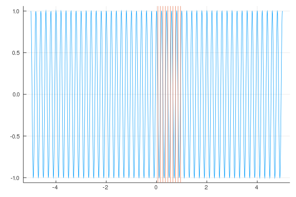

````julia
f(x) = x^5 - x^4 + x^3 - x^2 + 1

plot(f)

cs = find_zeros(f, -10, 10)

hline!([0])

vline!(cs)
````


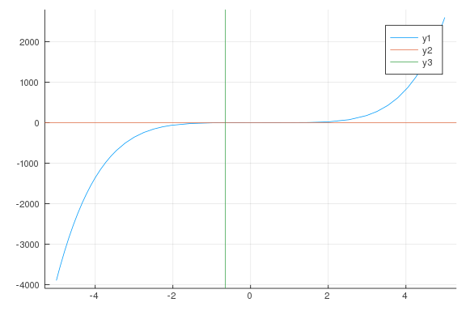

````julia
f(x) = exp(x) - x^5
zs = find_zeros(f, -20, 20)

f.(zs)
````


````
2-element Array{Float64,1}:
 0.0
 0.0
````


## Extreme Points

````julia
f(x) = x * exp(-x)
plot(f, 0, 5)
````


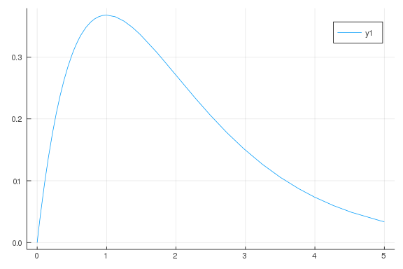

````julia
f(x) = (x^2)^(1/3)
plot(f, -2, 2)
````


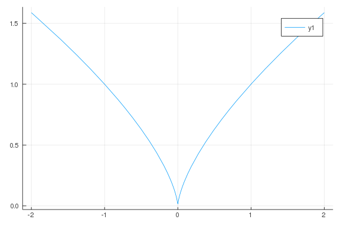

````julia
f(x) = e^x - x^4
plot(f, -10, 0, legend=false)

z = find_zeros(f, -10, 0)
vline!(z)
````


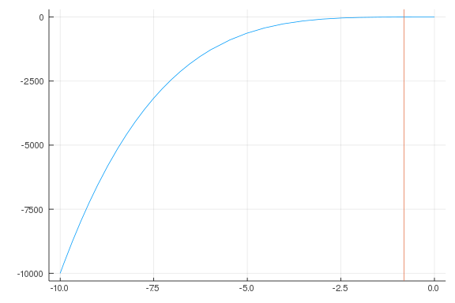

````julia
f(x) = e^x - x^4
plot(f, 0, 5)

z = find_zeros(f, 0, 5)

vline!([z])
````


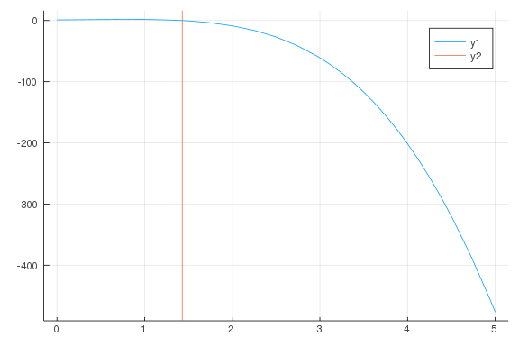

````julia
f(x) = x^2 - 10*x*log(x)
plot(f, 0, 100)
hline!([0])

z = find_zeros(f, 25, 50)

vline!(z)
````


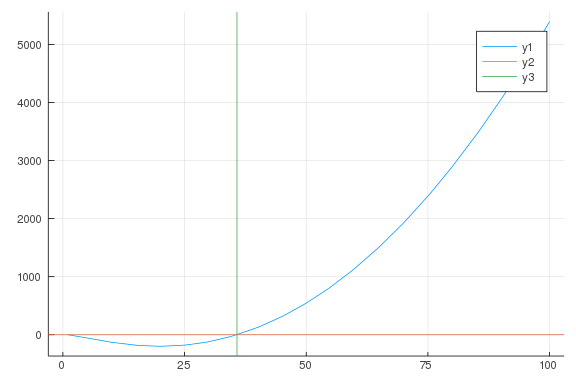

````julia
plot(airyai, -10, 10)   # `airyai` loaded in `SpecialFunctions` by `CalculusWithJulia`

plot(airyai, -100, 0)   # `airyai` loaded in `SpecialFunctions` by `CalculusWithJulia`

lower, upper = -10, 0
plot(airyai, lower, upper, legend = false)
hline!([0])   # `airyai` loaded in `SpecialFunctions` by `CalculusWithJulia`
z = find_zeros(airyai, lower, upper)
second_largest = sort(z)[end-1]
vline!([second_largest])

round(second_largest, digits=3)

zy = airyai(second_largest)
round(zy)
````


````
-0.0
````


````julia
f(x) = x^3
g(x) = 3x

plot(f, legend = false)
plot!(g)

h(x) = g(x) - f(x)

plot!(h)

z = find_zeros(h, 1, 100)

vline!([z])
````


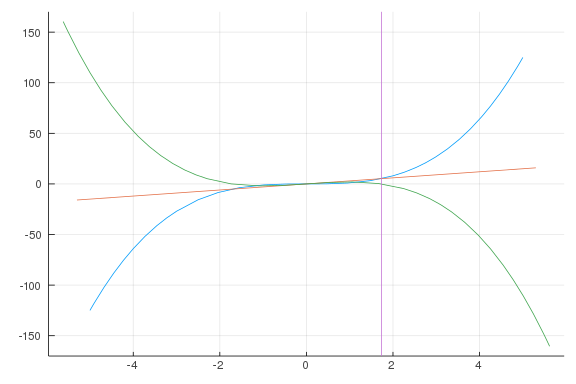

````julia
f(x) = x^2
g(x) = 2^x

h(x) = f(x) - g(x)

plot(f, legend = false)
plot!(g)
plot!(h)
hline!([0])

zx = find_zeros(h, 0, 10)
zx[end]
````


````
4.0
````


````julia
using ForwardDiff

v₀ = 390
f(t) = -(1/2)*32t^2 + v₀*t

D(f) = x -> ForwardDiff.derivative(f, x)

plot(f, -10, 40, legend = false)
hline!([0])

find_zeros(f, 0, 40)
find_zeros(D)
````


````
Error: MethodError: no method matching find_zeros(::typeof(Main.WeaveSandBo
x7.D))
Closest candidates are:
  find_zeros(::Any, !Matched::Any, !Matched::Any; no_pts, k, naive, kwargs.
..) at C:\Users\bmore\.juliapro\JuliaPro_v1.4.1-1\packages\Roots\sNoys\src\
find_zeros.jl:216
````


````julia
h(t; g=32, v0=390, gamma=1) = (g/gamma^2 + v0/gamma)*(1 - exp(-gamma*t)) - g*t/gamma

Dt(f) = x -> ForwardDiff(h, t)
Dv(f) = x -> ForwardDiff(h, v0)
Dγ(f) = x -> ForwardDiff(h, gamma)

plot(h, 0, 20)

Dt(0)
````


````
#8 (generic function with 1 method)
````


````julia
plot(sin, -2pi, 2pi)
plot(sin, -pi, pi)
plot(sin, -pi/2, pi/2)
````


````julia
f(x) = 1/x

plot(f, 1, 2)
plot(f, 0, 10)
````


````julia
plot(sign, -1, 1)
plot(1/x, -4, 1)
plot(floor, -1/2, 1/2)
````


````julia
a,b = 1, 2
k_x, k_y = 3, 4
plot(t -> a * cos(k_x *t), t-> b * sin(k_y * t), 0, 4pi)
````


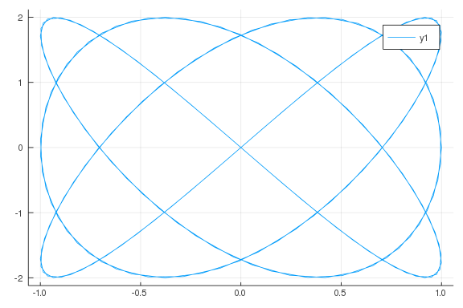

````julia
plot(sin, 0, 10pi)
````


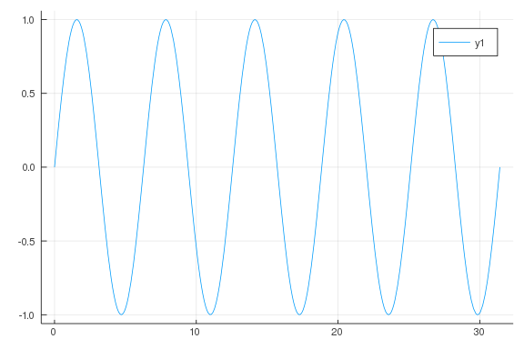

````julia
plot(sin, 0, 2pi)
plot(sin, -2pi, 2pi)
plot(sin, -pi/2, pi/2)
````


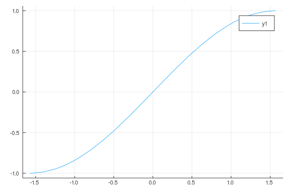

````julia
f(x) = cos(x)cosh(x)

plot(f, 0, 6pi)

zx = find_zeros(f, 0, 6pi)
zx[end]
````


````
17.27875959474386
````


